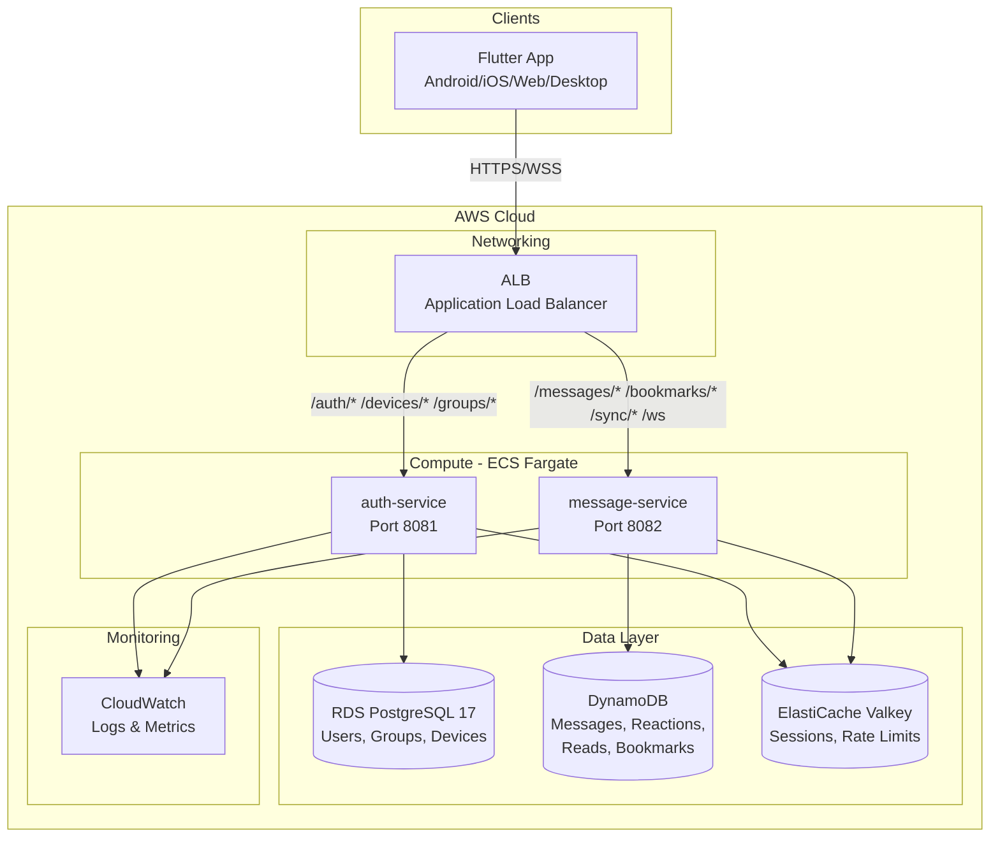
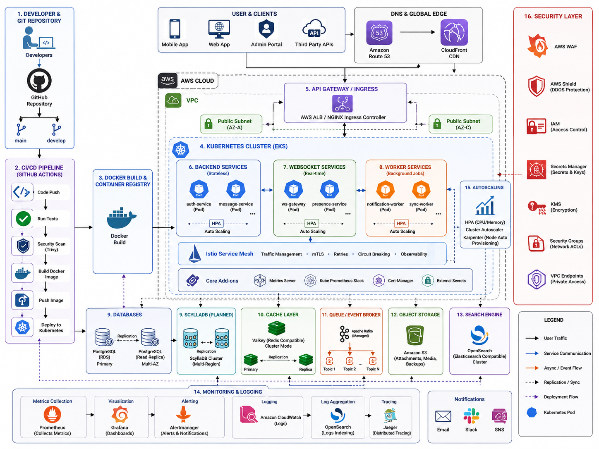

# CloseTalk

**High-performance, cross-platform real-time communication app** — modern messaging built for 2026.

CloseTalk is a real-time chat application that connects people through instant messaging, group conversations, voice/video calls, and AI-powered features. Built with Flutter for cross-platform reach and a cloud-native backend for scale.

CloseTalk fixes every major problem WhatsApp users have faced — TCP head-of-line blocking, phone-dependent multi-device, raw contact upload to servers, media quality loss, manual spam reporting, and hard-to-scale architecture.

## Features

- **Instant Messaging** — Send text, images, voice notes, and files with real-time delivery and read receipts
- **Group Chats** — Create groups up to 1,000 members with admin controls, @mentions, and pinned messages
- **Voice & Video Calls** — One-to-one and group calls with AI noise suppression
- **Native Multi-Device** — Phone NOT required as relay. Each device connects independently with its own WebTransport session
- **AI Assistant** — Context-aware chat assistant with persistent memory for summaries, suggestions, and answers
- **Content Moderation** — Real-time AI-powered filtering for hate speech, PII, and harassment using Bedrock Guardrails
- **Stories / Status** — 24h ephemeral photo, video, and text posts with privacy controls
- **Broadcast & Channels** — One-to-many messaging with subscribe/unsubscribe
- **In-Chat Polls** — Create, vote, and see live results
- **Inline Translation** — Tap any message to translate via AI
- **Full-Text Search** — Search across all chats with filters (date, sender, chat)
- **Typing Indicators & Presence** — Live typing status and online presence via WebTransport datagrams (QUIC, <20ms)
- **Message Retention** — Per-chat auto-delete: off / 30d / 90d / 1yr
- **Disappearing Messages** — 5s / 30s / 5m / 1h / 24h per chat
- **Block List & Privacy Controls** — Granular last-seen, profile photo, read receipts, and group add permissions
- **End-to-End Encryption** — Optional Signal Protocol with per-device key pairs
- **Cross-Platform** — Android, iOS, Web, Windows, macOS, and Linux from a single Flutter codebase

## Tech Stack

| Layer | Technology |
|---|---|
| Frontend | Flutter (Dart) — Android, iOS, Web, Desktop |
| Backend | Go 1.26 on ECS Fargate |
| Transport | WebSocket + HTTP/REST |
| Relational DB | RDS PostgreSQL 17 |
| NoSQL | Amazon DynamoDB (messages, reactions, reads, bookmarks) |
| Cache | Amazon ElastiCache Valkey 8.1 |
| AI | Amazon Bedrock AgentCore (Claude 3.5 Haiku / Nova Micro) |
| Events | SQS FIFO + EventBridge Pipes + SNS |
| Networking | AWS ALB + VPC |
| CDN | Amazon CloudFront |

## Architecture





The system uses a **disaggregated architecture** — each layer scales independently. Compute is stateless (just add more Fargate tasks). Data is routed to the best engine for each job: ACID metadata to RDS PostgreSQL, high-throughput messages to DynamoDB, low-latency session state to ElastiCache Valkey.

## Backend API

**Production URL:** [`https://d34etjxuah5cvp.cloudfront.net/`](https://d34etjxuah5cvp.cloudfront.net/)

| Endpoint | Method | Description |
|---|---|---|
| `/` | GET | API info |
| `/health` | GET | Health check |
| `/auth/register` | POST | Register user |
| `/auth/login` | POST | Login |
| `/auth/refresh` | POST | Refresh JWT |
| `/messages/{chatId}` | GET | Get messages |
| `/bookmarks` | GET | List bookmarks |
| `/ws` | GET | WebSocket |

## Getting Started

### Prerequisites

- Go 1.26+
- Docker & Docker Compose
- Terraform 1.6+ (for AWS deployment)
- AWS CLI (for AWS deployment)

### Run Locally with Docker Compose

```bash
cd closetalk_backend
docker-compose up
```

This starts: auth-service (8081), message-service (8082), PostgreSQL 17, Valkey 8.1, and DynamoDB Local.

### Deploy to AWS

```bash
# 1. Provision infrastructure
cd terraform
cp terraform.tfvars.example terraform.tfvars
# Edit terraform.tfvars with your values
terraform init
terraform apply

# 2. Push images and deploy
# Push to ECR and deploy via GitHub Actions
# (or manually with the script below)
```

See [docs/infrastructure.md](docs/infrastructure.md) for full deployment details.

## Project Structure

```
closetalk/
├── closetalk_app/         # Flutter app (Android, iOS, Web, Desktop)
├── closetalk_backend/     # Go backend services
│   ├── cmd/
│   │   ├── auth-service/      # Authentication + groups API
│   │   └── message-service/   # Messaging + WebSocket API
│   ├── internal/
│   │   ├── auth/              # JWT, password hashing
│   │   ├── database/          # Neon, DynamoDB, Valkey, MemStore
│   │   ├── middleware/        # Auth, logging, rate limiting
│   │   └── model/             # Data models
│   ├── infrastructure/migrations/  # SQL migrations
│   ├── docker-compose.yml     # Local dev environment
│   └── Dockerfile             # Multi-stage build
├── terraform/              # AWS infrastructure as code
├── .github/workflows/      # CI/CD pipelines
├── docs/                   # Documentation
└── README.md
```


## Documentation

| Document                         | Description                                |
| -------------------------------- | ------------------------------------------ |
| `docs/architecture.md`           | Architecture                               |
| `docs/architecture-flow.md`      | Architecture Diagrams (Mermaid)            |
| `docs/security.md`               | Security, Compliance & Maintenance         |
| `docs/requirements.md`           | Requirements (Functional + Non-Functional) |
| `docs/planning.md`               | Project Planning Checklist                 |
| `docs/product-vision.md`         | Product Vision & UX                        |
| `docs/multi-device-sync.md`      | Multi-Device Sync Protocol                 |
| `docs/whatsapp-gap-analysis.md`  | WhatsApp Gap Analysis & Fixes              |
| `docs/closetalk-architecture.md` | Full Architectural Standard (PDF extract)  |
| `docs/infrastructure.md`         | Deployment Infrastructure                  |


## Cost Overview

| Stage | Users | DAU | Monthly Cost |
|---|---|---|---|
| MVP | 0–1,000 | 0–1,000 | $5–$10 |
| Growth | 1K–100K | 1K–10K | ~$990 |
| Scale | 100K–1M | 10K–100K | TBD (infra optimized) |

## License

MIT
