# CloseTalk — Architecture & Service Flow

## 1. High-Level System Architecture

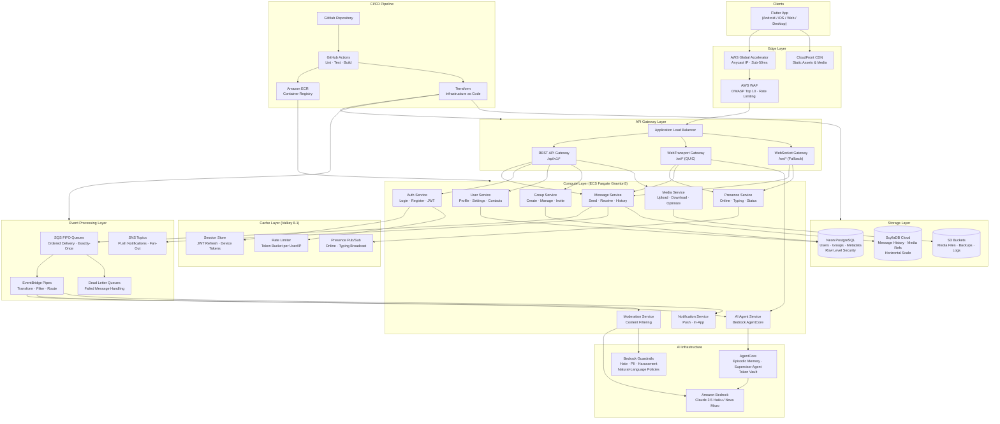

---

## 2. User Authentication Flow

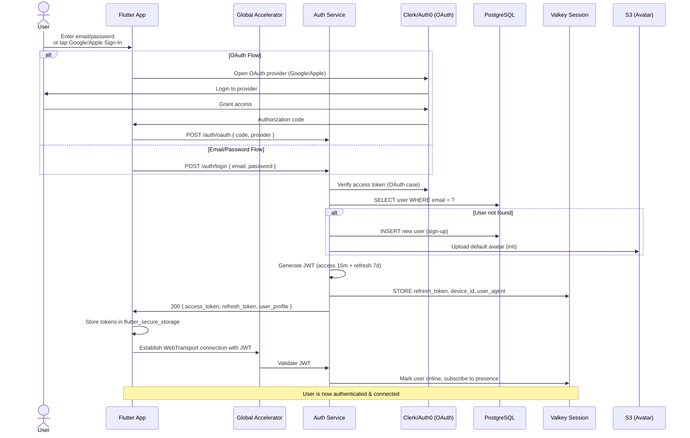

---

## 3. Real-Time Message Delivery Flow

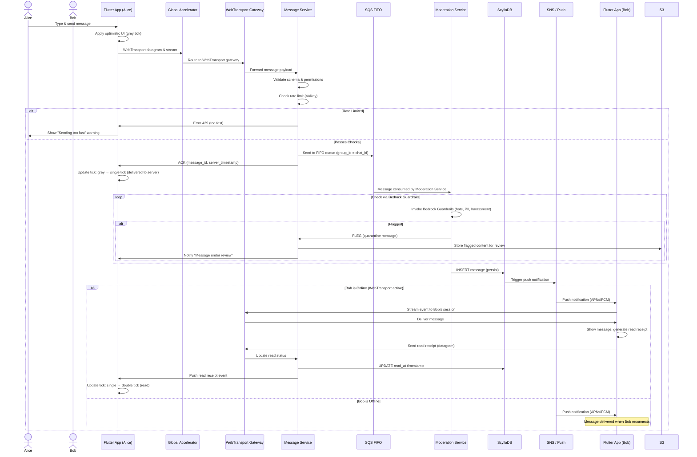

---

## 4. WebTransport Connection & Presence Flow

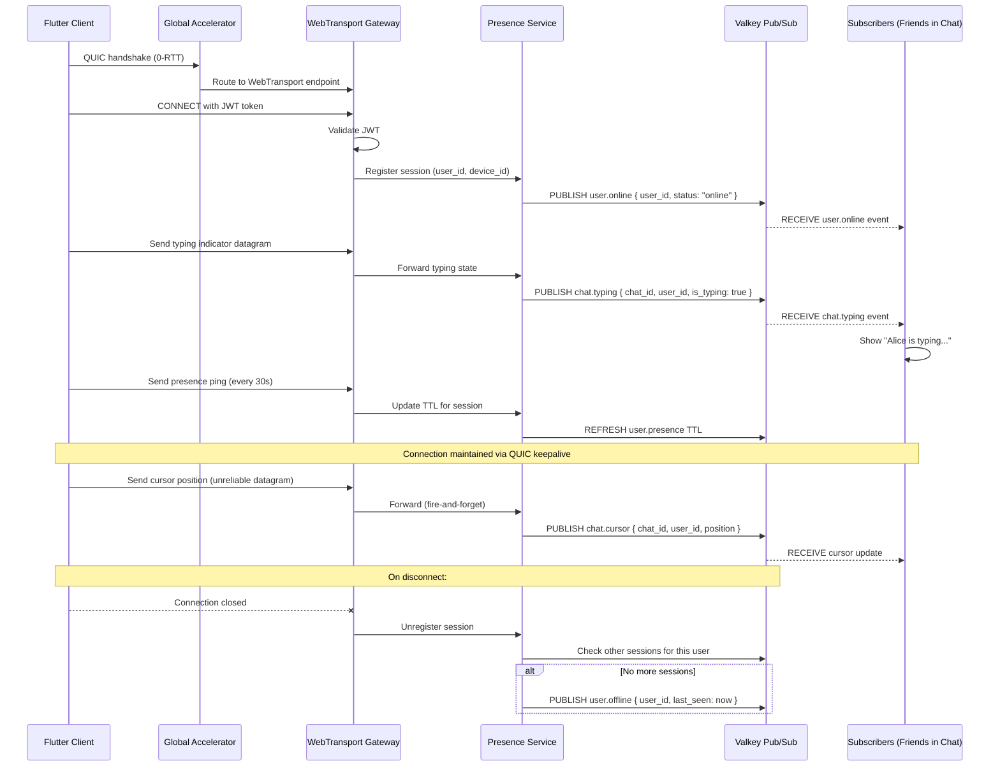

---

## 5. Content Moderation Pipeline Flow

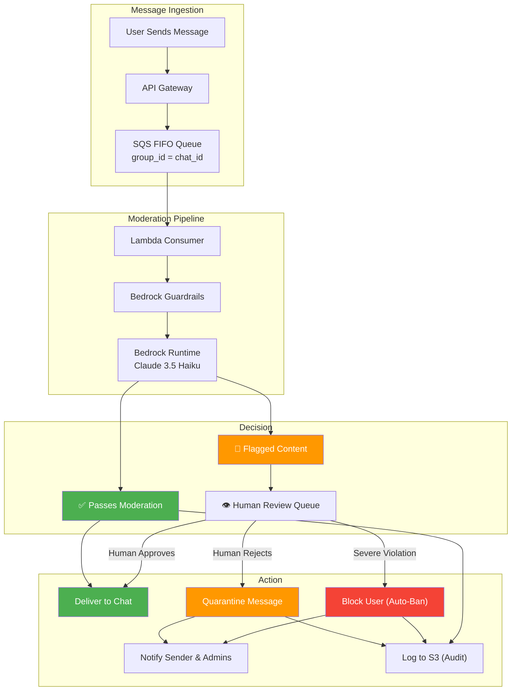

---

## 6. Database Architecture (Polyglot Persistence)


### Database Mapping to Storage Engines

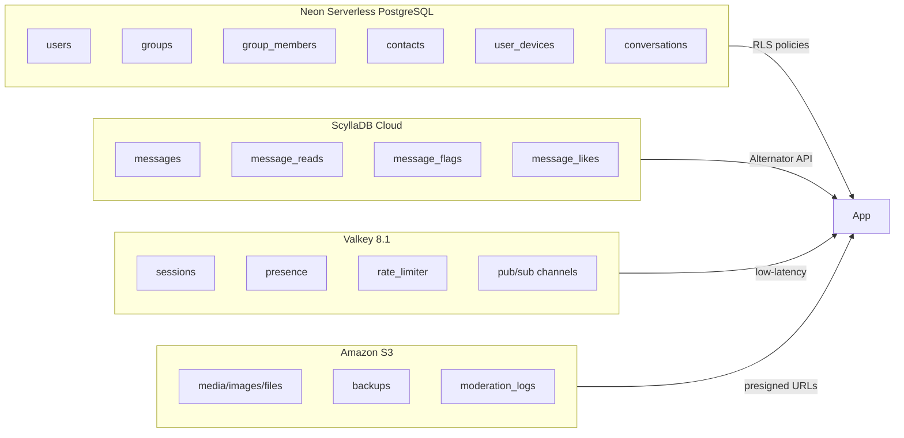

---

## 7. Deployment & CI/CD Flow

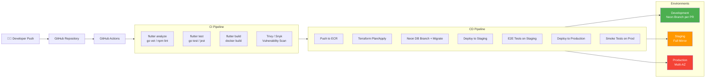

---

## 8. Service-to-Service Communication

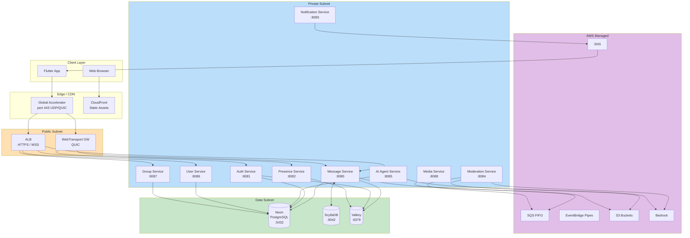

---

## 9. Data Flow: Message Lifecycle

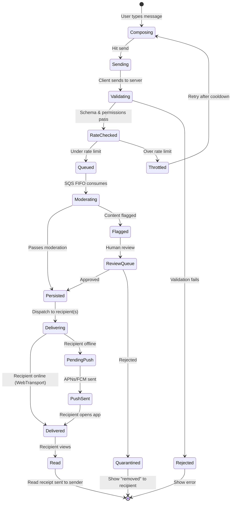

---

## 10. Scaling Flow (Auto-Scaling)

```mermaid
flowchart LR
    subgraph Trigger["Auto-Scaling Triggers"]
        CPU["CPU > 70%"]
        MEM["Memory > 75%"]
        LAT["p99 Latency > 200ms"]
        CONN["Active Connections > 80% Capacity"]
    end

    subgraph ScaleOut["Scale-Out Process"]
        CLOUDWATCH["CloudWatch Alarm"]
        ASG["ECS Service Auto-Scaling"]
        TASK["New Fargate Task Spawned<br/>(~30s warm-up)"]
        REGISTER["Register with ALB<br/>Health Check Pass"]
    end

    subgraph ScaleIn["Scale-In Process"]
        CW_IN["CloudWatch Alarm (low traffic)"]
        ASG_IN["Cooldown Period (300s)"]
        DRAIN["Connection Draining<br/>(30s grace)"]
        DEREGISTER["Deregister from ALB"]
    end

    CPU --> CLOUDWATCH
    MEM --> CLOUDWATCH
    LAT --> CLOUDWATCH
    CONN --> CLOUDWATCH

    CLOUDWATCH --> ASG
    ASG --> TASK
    TASK --> REGISTER
    REGISTER --> SVC["Service Capacity +1"]

    CW_IN --> ASG_IN
    ASG_IN --> DRAIN
    DRAIN --> DEREGISTER
    DEREGISTER --> SVC_IN["Service Capacity -1"]

    NB["Note: Database layer scales independently:<br/>Neon: compute auto-pause/resume<br/>ScyllaDB: add nodes via Tablets rebalancing<br/>Valkey: cluster mode sharding"]

---

## 11. Media Upload & Processing Pipeline

```mermaid
sequenceDiagram
    participant Client as Flutter Client
    participant MS as Media Service
    participant S3 as S3 Bucket
    participant Lambda as Async Lambda
    participant CF as CloudFront CDN
    participant VL as Valkey (Thumbnail Cache)
    participant CV as ClamAV (Virus Scan)

    Client->>MS: POST /media/upload-url { file_type, file_size, chat_id }
    MS->>MS: Validate file size & type
    MS->>S3: Generate presigned PUT URL (expires in 5 min)
    MS->>Client: 200 { upload_url, media_id, cdn_url }

    Client->>S3: PUT directly to S3 (raw file, original quality)
    S3->>Client: 201 ETag
    Client->>MS: POST /media/confirm { media_id, etag }

    Note over S3,CV: Server never touches raw bytes (no quality loss)

    S3->>Lambda: Trigger on s3:ObjectCreated

    par Virus Scan
        Lambda->>S3: Read file bytes
        Lambda->>CV: Scan for malware
        alt Malware Detected
            Lambda->>S3: Move file to quarantine/
            Lambda->>MS: Update status: "quarantined"
            MS->>Client: Alert "File flagged for review"
        end
    and Thumbnail Generation (images)
        Lambda->>Lambda: Generate thumbnails (100x100, 400x400, 1200x1200)
        Lambda->>S3: Store thumbnails
    and Video Transcoding (if video)
        Lambda->>Lambda: Transcode to HLS (1080p, 720p, 480p)
        Lambda->>S3: Store HLS segments + playlist
    and Image Optimization
        Lambda->>Lambda: Convert to WebP/AVIF
        Lambda->>S3: Store optimized versions
    end

    Lambda->>VL: Cache thumbnail URLs (TTL: 1hr)
    Lambda->>MS: Update status: "ready"
    MS->>Client: Push notification: media ready

    Client->>CF: GET /media/{media_id}/thumbnail.jpg
    CF->>S3: Fetch from origin (if not cached)
    CF->>Client: Deliver thumbnail (cached at edge)
```

## 12. Privacy-Preserving Contact Discovery Flow

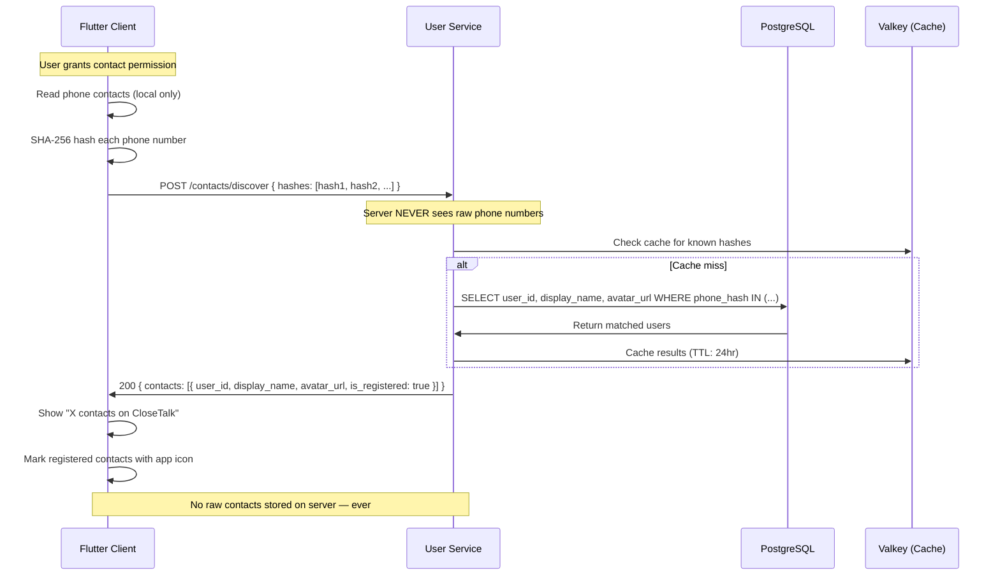

## 13. Account Recovery Flow

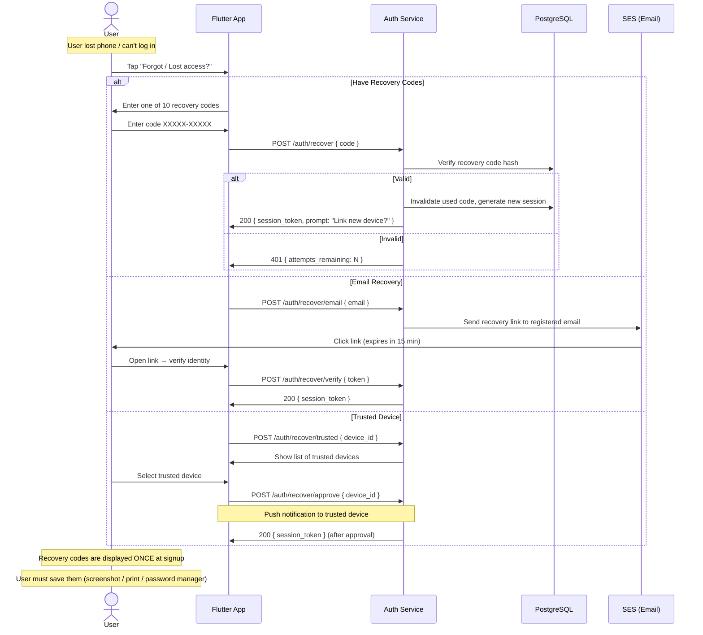

## 14. Full-Text Search Flow

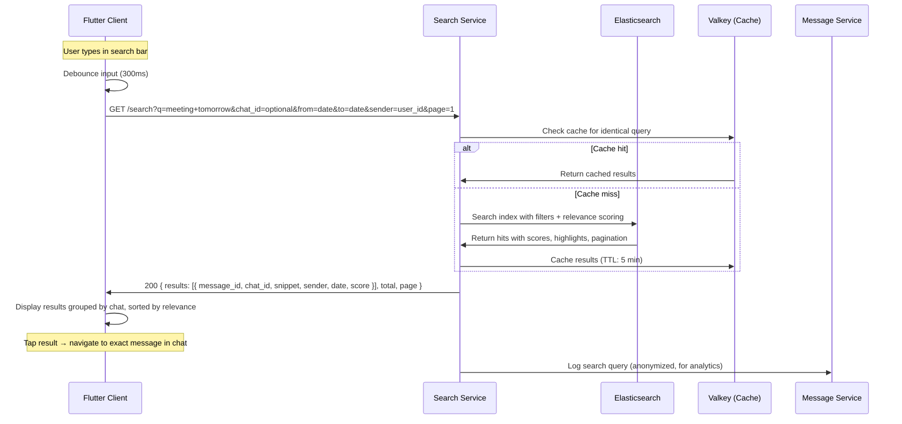

## 15. Stories / Status Flow

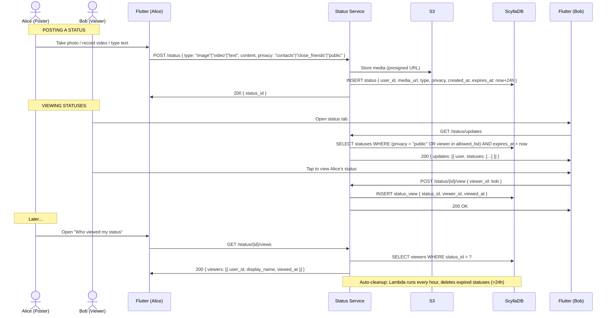

## 16. Broadcast & Channels Flow

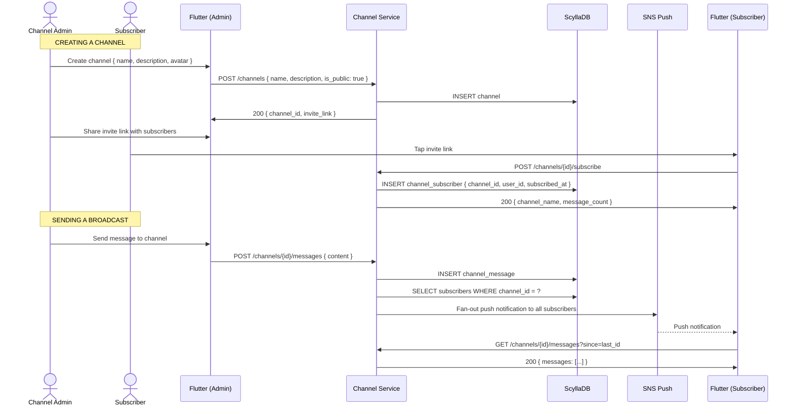

## 17. Graceful Degradation & Circuit Breakers

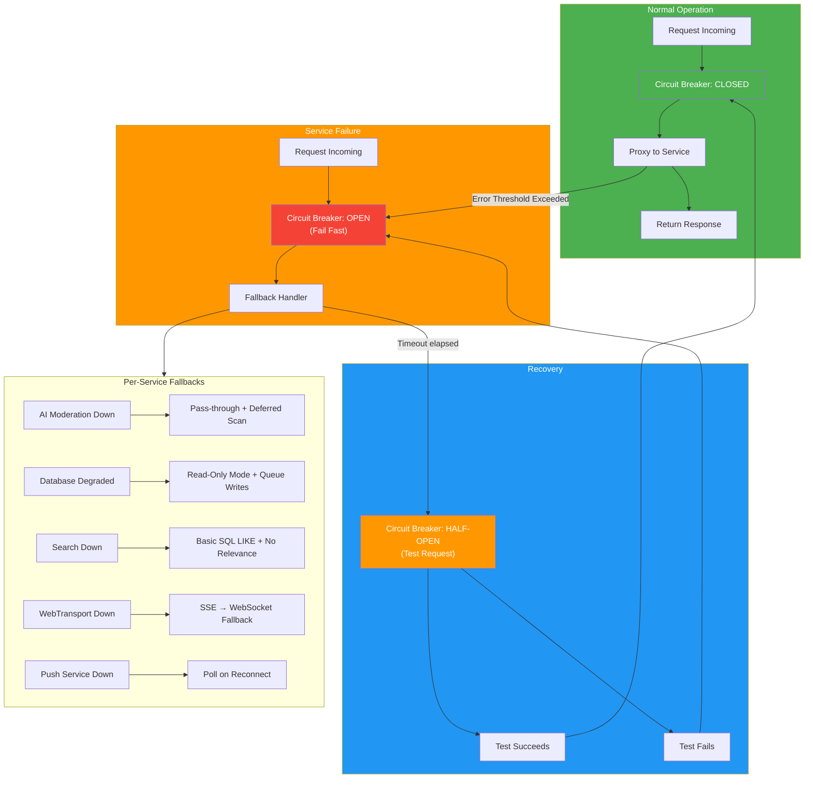

## 18. Offline Message Queue & Catch-Up Sync

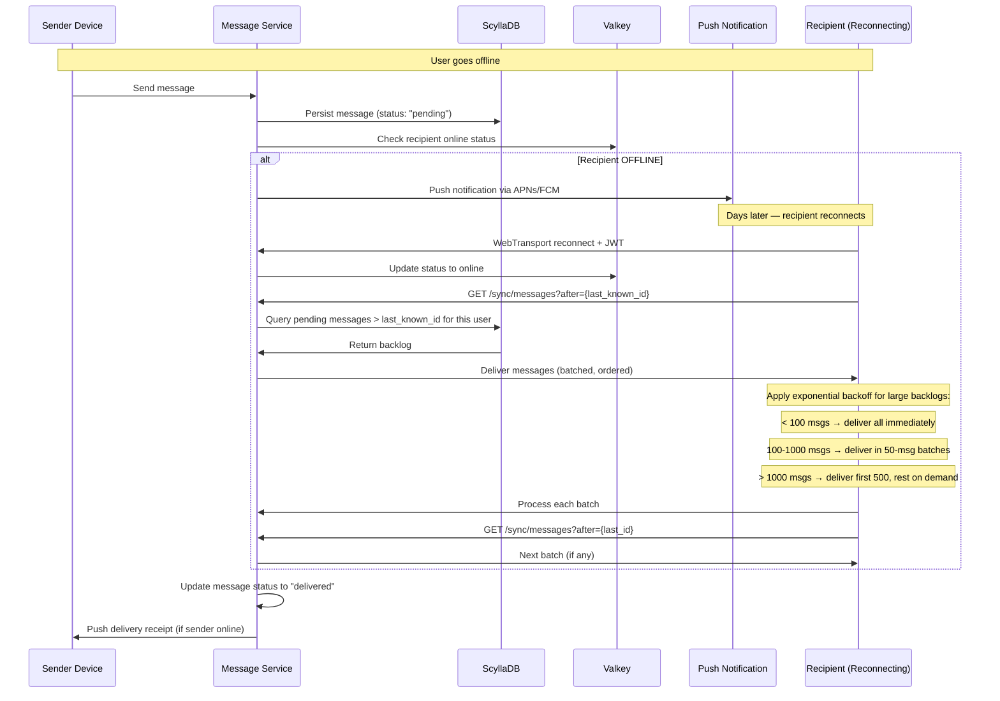

## 19. Feature Flag System

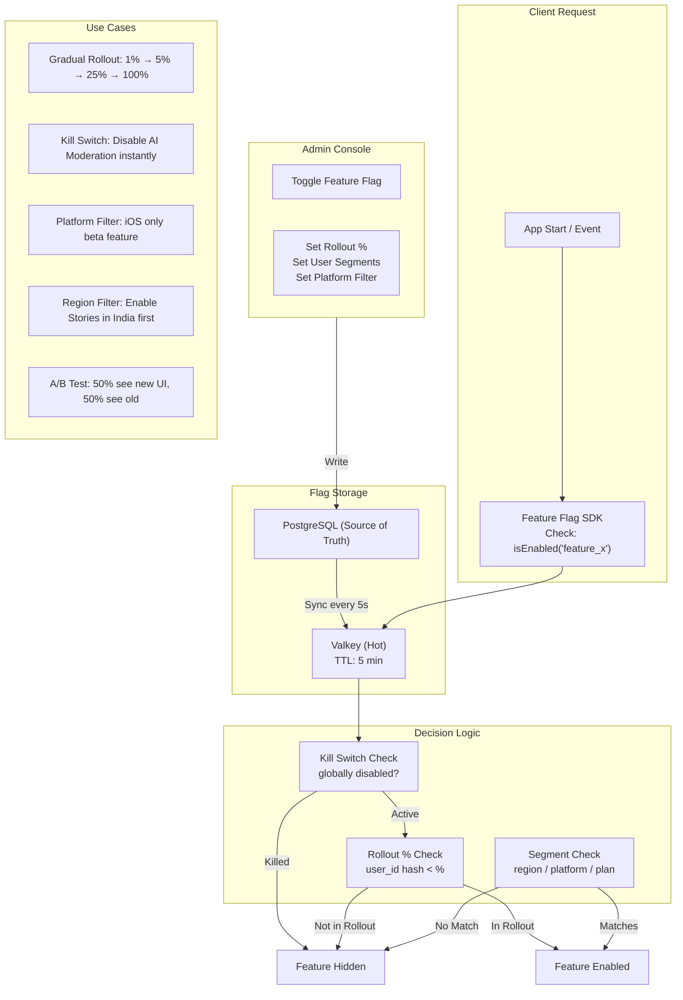
