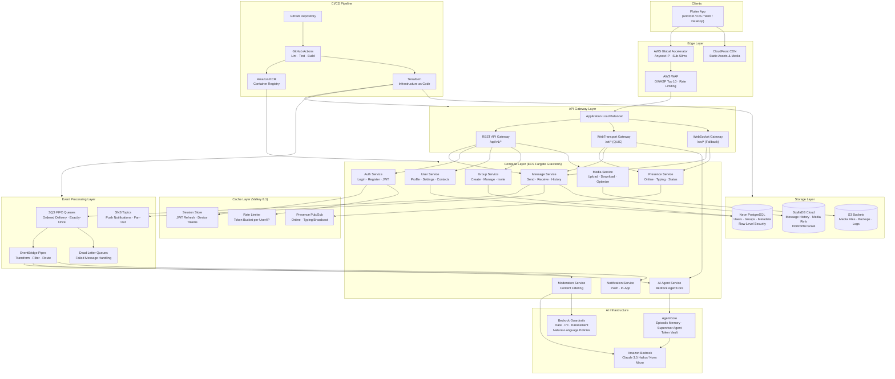
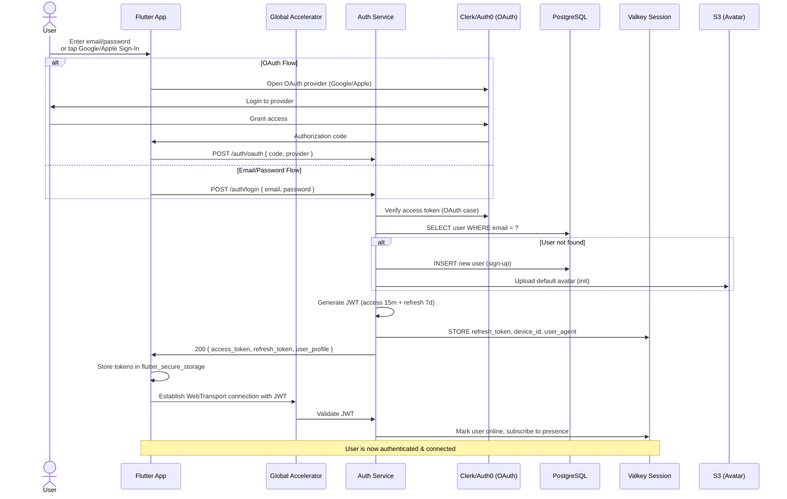
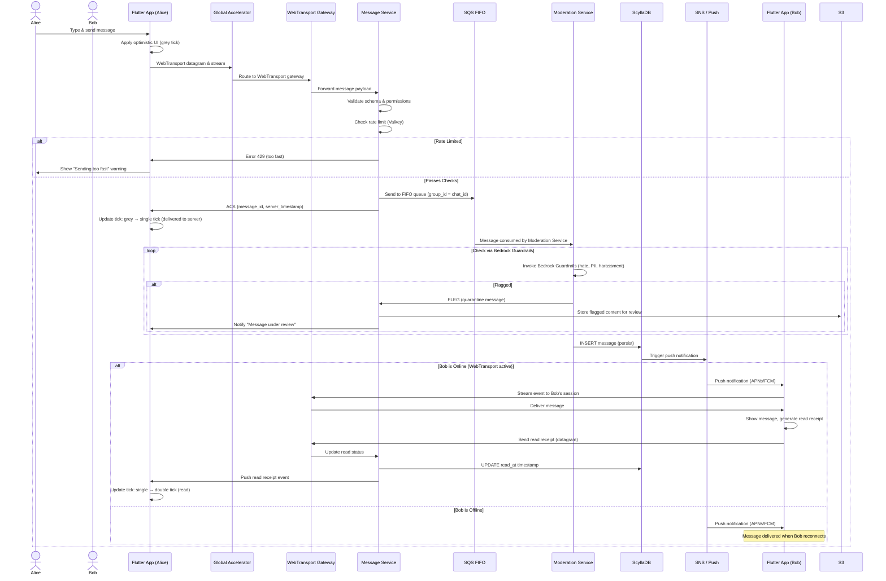
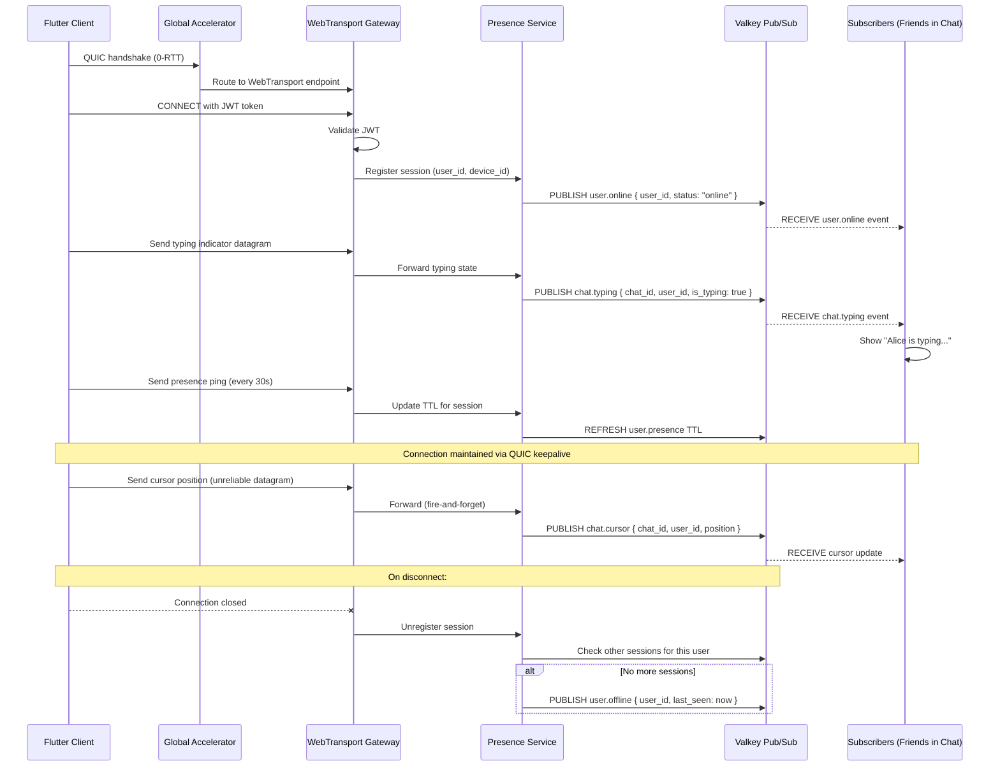
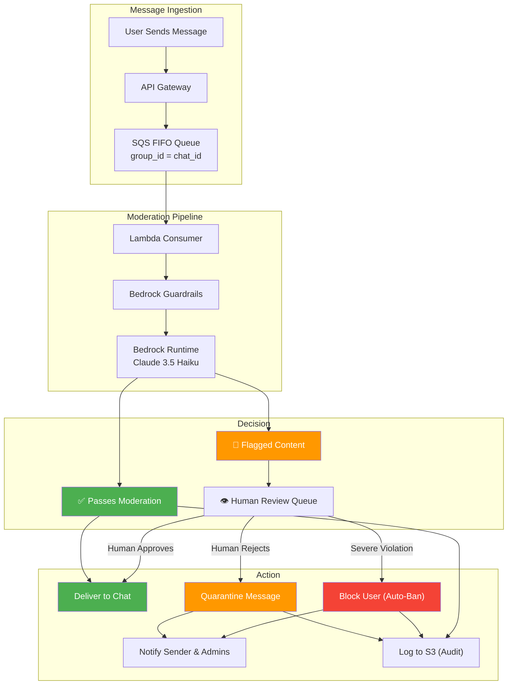
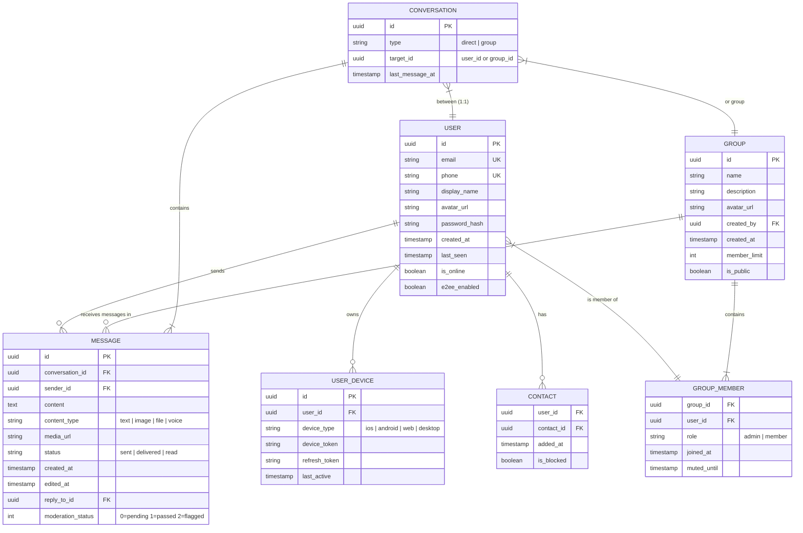
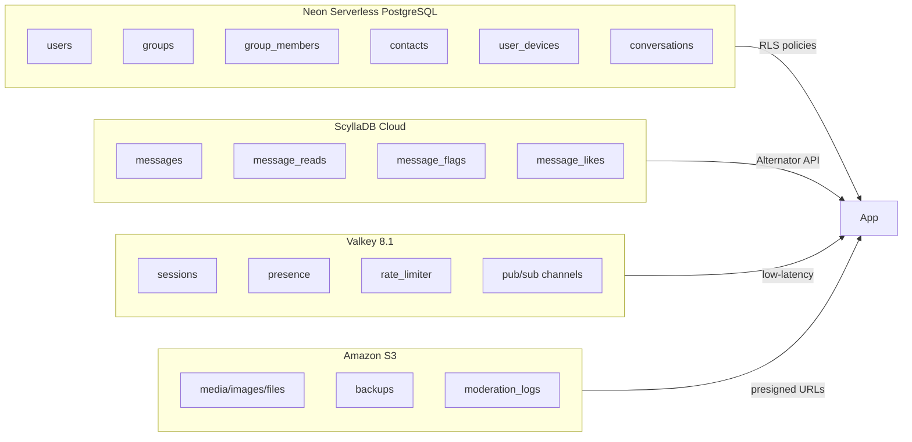
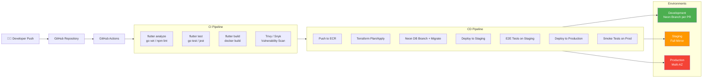
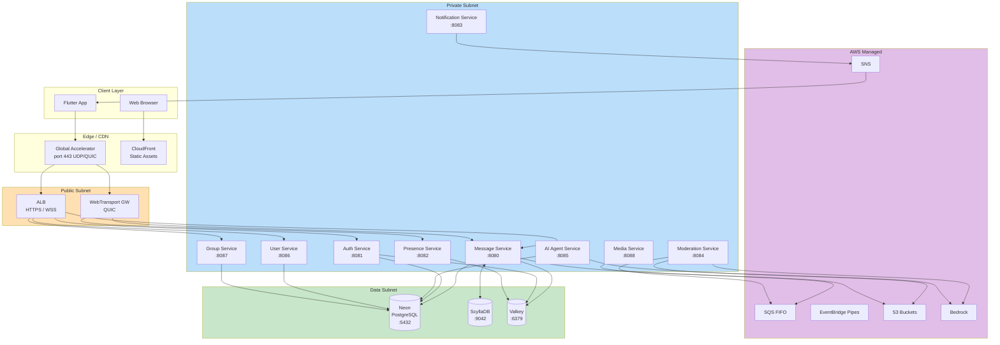
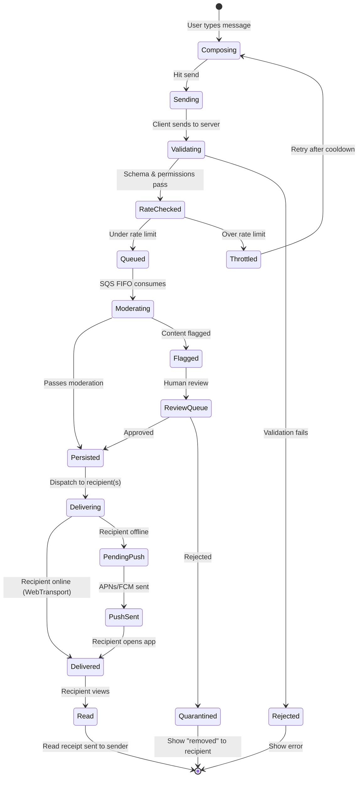

# CloseTalk — Architecture & Service Flow

## 1. High-Level System Architecture



---

## 2. User Authentication Flow



---

## 3. Real-Time Message Delivery Flow



---

## 4. WebTransport Connection & Presence Flow



---

## 5. Content Moderation Pipeline Flow



---

## 6. Database Architecture (Polyglot Persistence)



### Database Mapping to Storage Engines



---

## 7. Deployment & CI/CD Flow



---

## 8. Service-to-Service Communication



---

## 9. Data Flow: Message Lifecycle



---

## 10. Scaling Flow (Auto-Scaling)

```mermaid
flowchart LR
    subgraph Trigger["Auto-Scaling Triggers"]
        CPU["CPU > 70%"]
        MEM["Memory > 75%"]
        LAT["p99 Latency > 200ms"]
        CONN["Active Connections > 80% Capacity"]
    end

    subgraph ScaleOut["Scale-Out Process"]
        CLOUDWATCH["CloudWatch Alarm"]
        ASG["ECS Service Auto-Scaling"]
        TASK["New Fargate Task Spawned<br/>(~30s warm-up)"]
        REGISTER["Register with ALB<br/>Health Check Pass"]
    end

    subgraph ScaleIn["Scale-In Process"]
        CW_IN["CloudWatch Alarm (low traffic)"]
        ASG_IN["Cooldown Period (300s)"]
        DRAIN["Connection Draining<br/>(30s grace)"]
        DEREGISTER["Deregister from ALB"]
    end

    CPU --> CLOUDWATCH
    MEM --> CLOUDWATCH
    LAT --> CLOUDWATCH
    CONN --> CLOUDWATCH

    CLOUDWATCH --> ASG
    ASG --> TASK
    TASK --> REGISTER
    REGISTER --> SVC["Service Capacity +1"]

    CW_IN --> ASG_IN
    ASG_IN --> DRAIN
    DRAIN --> DEREGISTER
    DEREGISTER --> SVC_IN["Service Capacity -1"]

    NB["Note: Database layer scales independently:<br/>Neon: compute auto-pause/resume<br/>ScyllaDB: add nodes via Tablets rebalancing<br/>Valkey: cluster mode sharding"]
