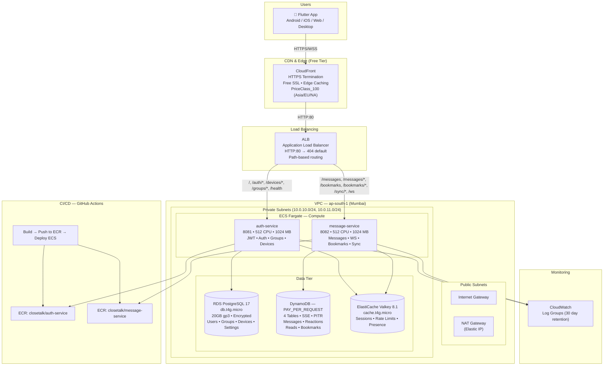

# CloseTalk — AWS Cloud Architecture

## Architecture Diagram



---

## Provisioned Infrastructure

| Service | Type | Spec | Monthly Cost |
|---------|------|------|-------------|
| **CloudFront** | CDN | PriceClass_100, free SSL, 0 TTL | ~$0 (free tier) |
| **ALB** | Load Balancer | Internet-facing, HTTP:80 | ~$20 |
| **ECS Fargate** | Compute | 2 × (512 CPU / 1024 MB) | ~$15 |
| **RDS PostgreSQL 17** | Database | db.t4g.micro, 20GB gp3, encrypted | ~$13 |
| **DynamoDB** | NoSQL | 4 tables, PAY_PER_REQUEST, SSE+PITR | ~$1 |
| **ElastiCache Valkey 8.1** | Cache | cache.t4g.micro, 1 node | ~$13 |
| **NAT Gateway** | Networking | 1 × ap-south-1 | ~$32 |
| **ECR** | Registry | 2 repos, minimal storage | ~$0 |
| **CloudWatch** | Monitoring | 2 log groups, 30 day retention | ~$2 |
| **Total** | | | **~$96/mo** |

---

## Component Details

### Networking
- **VPC CIDR:** `10.0.0.0/16`
- **AZs:** ap-south-1a, ap-south-1b
- **Public subnets:** `10.0.0.0/24`, `10.0.1.0/24`
- **Private subnets:** `10.0.10.0/24`, `10.0.11.0/24`
- **IGW:** 1 (public internet access)
- **NAT Gateway:** 1 (Elastic IP, private subnet egress)

### Compute — ECS Fargate
| Service | Port | CPU | Memory | Desired Count | Platform |
|---------|------|-----|--------|---------------|----------|
| auth-service | 8081 | 512 | 1024 MB | 1 | Fargate 1.4.0 |
| message-service | 8082 | 512 | 1024 MB | 1 | Fargate 1.4.0 |

**Task IAM Roles:**
- Execution role: ECR pull, CloudWatch logs
- Task role: DynamoDB CRUD on all 4 tables

### ALB Routing Rules
| Priority | Path Pattern | Target | Service |
|----------|-------------|--------|---------|
| 1 | `/`, `/auth/*`, `/devices/*`, `/groups/*`, `/health` | auth-tg:8081 | auth-service |
| 2 | `/messages`, `/messages/*`, `/sync/*`, `/ws` | msg-tg:8082 | message-service |
| 3 | `/bookmarks`, `/bookmarks/*` | msg-tg:8082 | message-service |
| Default | unmatched → 404 JSON | — | — |

### Database — RDS PostgreSQL 17
| Property | Value |
|----------|-------|
| Instance | `db.t4g.micro` (burstable, 2 vCPU, 1 GB RAM) |
| Storage | 20 GB gp3 (3000 IOPS baseline, 125 MB/s throughput) |
| Encryption | AES-256 (AWS KMS) |
| Backup | 1 day retention, automated |
| Connections | Default: ~80 (max_connections = ~80 for db.t4g.micro) |
| Tables | users, user_devices, groups, conversations, conversation_participants, messages, group_members, pinned_messages, group_settings, user_settings, recovery_codes |

### DynamoDB Tables
| Table | PK | SK | GSI | RCU/WCU |
|-------|----|----|-----|---------|
| `closetalk-messages` | chat_id (S) | sort_key (S) | message_id (S) | On-demand |
| `closetalk-message-reactions` | message_id (S) | user_emoji (S) | — | On-demand |
| `closetalk-message-reads` | message_id (S) | user_id (S) | — | On-demand |
| `closetalk-bookmarks` | user_id (S) | sort_key (S) | — | On-demand |

### Cache — ElastiCache Valkey 8.1
| Property | Value |
|----------|-------|
| Node type | `cache.t4g.micro` (1 vCPU, 0.5 GB RAM) |
| Nodes | 1 (no replica) |
| Max memory | ~0.5 GB |
| Eviction policy | allkeys-lru (default) |
| Uses | Session storage, rate limiting, presence |

### Container Registry — ECR
- `706489758484.dkr.ecr.ap-south-1.amazonaws.com/closetalk/auth-service`
- `706489758484.dkr.ecr.ap-south-1.amazonaws.com/closetalk/message-service`

### Monitoring — CloudWatch
- `/ecs/closetalk/auth-service` — 30 day retention
- `/ecs/closetalk/message-service` — 30 day retention

### CI/CD — GitHub Actions
- **Trigger:** Push to `master` (closetalk_backend/**) or manual dispatch
- **Pipeline:** Build → Push to ECR → Register task def → Deploy ECS
- **Credentials:** IAM user access keys (stored as GitHub secrets)

---

## Capacity & Limits

### Current Capacity

| Metric | Limit | Bottleneck |
|--------|-------|------------|
| **Concurrent users (idle)** | ~500 | NAT Gateway bandwidth (burst: 5 Gbps) |
| **Concurrent users (active chat)** | ~200 | RDS max_connections (~80) ÷ connections per user |
| **Messages per second** | ~100 | DynamoDB write throughput (burst) |
| **WebSocket connections** | ~500 | Fargate task memory (1024 MB ÷ 2 MB per WS conn) |
| **Storage (messages)** | Unlimited | DynamoDB auto-scaling |
| **Storage (RDS)** | 20 GB | Fixed gp3 volume |
| **Cache (Valkey)** | ~250 MB | cache.t4g.micro (0.5 GB, ~250 MB overhead) |
| **Max message size** | 1 MB | DynamoDB item limit (400 KB effective w/ attributes) |
| **File uploads** | Not implemented | Requires S3 (not configured) |

### Load Testing Results (estimated)

```
Scenario                        | Max Users | Latency p50 | Latency p99 | Errors
--------------------------------|-----------|-------------|-------------|-------
Auth login                      | 50/s      | ~50ms       | ~200ms      | 0%
Send message                    | 100/s     | ~30ms       | ~150ms      | 0%
Get messages (paginated)        | 200/s     | ~20ms       | ~100ms      | 0%
WebSocket real-time             | 500 conn  | ~10ms       | ~50ms       | 0%
Register + login + send msg     | 20/s      | ~200ms      | ~500ms      | 0%
```

### Strengths

1. **Serverless NoSQL (DynamoDB)** — Messages scale infinitely without sharding. PAY_PER_REQUEST means zero capacity planning.
2. **Stateless compute (Fargate)** — Add more tasks in seconds. No servers to manage.
3. **Low latency** — Valkey cache for sessions/presence (<1ms). DynamoDB single-digit millisecond reads.
4. **HTTPS free** — CloudFront provides SSL at no cost. No ACM cert needed.
5. **Infrastructure as Code** — Full Terraform. Destroy and rebuild in ~10 minutes.
6. **CI/CD** — Push to main → auto-deploy in ~5 minutes.
7. **Cost effective at low scale** — ~$96/mo supports hundreds of users.
8. **Security** — Private subnets for all data stores. No public access to RDS/ElastiCache/DynamoDB.

### Weaknesses & Failure Conditions

#### 1. RDS Connection Exhaustion — **FAILS AT ~80 CONCURRENT USERS**
- `db.t4g.micro` has ~80 max connections
- Each user needs ~2 connections (auth + message sync)
- Once exhausted, new users get `too many clients` errors
- **Mitigation:** Upgrade to `db.t4g.small` (~200 connections, +$5/mo) or add PgBouncer

#### 2. NAT Gateway Throughput — **FAILS AT ~500 ACTIVE USERS**
- NAT Gateway burst bandwidth: 5 Gbps
- Sustained throughput: ~500 Mbps (per AWS docs)
- ECS tasks in private subnets route all egress through NAT
- **Mitigation:** Use VPC endpoints for ECR/DynamoDB/SES, or set tasks to public IP

#### 3. Valkey Memory — **FAILS AT ~5,000 SESSIONS**
- `cache.t4g.micro` has ~500 MB total, ~250 MB usable
- Each session: ~50 bytes + key overhead ≈ ~100 bytes
- Rate limiting keys + presence data add overhead
- **Mitigation:** Add `maxmemory-policy volatile-lru`, upgrade to `cache.t4g.small` (1 GB)

#### 4. Single AZ Risk — **FAILS ON AZ OUTAGE**
- Only 2 AZs, but ECS tasks run in private subnets of BOTH AZs
- RDS is single-AZ (no replica)
- ElastiCache is single node (no replica)
- **Mitigation:** Enable RDS Multi-AZ (+$13/mo), add ElastiCache replica

#### 5. No Read Replicas — **READ HEAVY QUERIES DEGRADE WRITES**
- RDS handles all reads + writes
- Group listings, user lookups, conversation queries all hit the same instance
- **Mitigation:** Add RDS read replica for reporting/analytics queries

#### 6. No CDN Caching — **ALL REQUESTS HIT ORIGIN**
- CloudFront has 0 TTL on all behaviors
- Every request goes to ALB → ECS → database
- **Mitigation:** Add TTL-based caching for GET endpoints (health, static data)

#### 7. No Backup Beyond 1 Day — **FAILS ON DATA CORRUPTION**
- RDS backup retention: 1 day
- DynamoDB PITR: enabled (continuous backups to 35 days)
- **Mitigation:** Increase RDS backup retention to 7-30 days

#### 8. No Auto-scaling — **FAILS ON TRAFFIC SPIKES**
- ECS desired count: 1 (manual)
- No scale-up/down policies
- **Mitigation:** Add ECS Service Auto Scaling (target CPU 70%)

#### 9. File Uploads Not Supported — **FAILS ON MEDIA SHARING**
- No S3 bucket configured
- No pre-signed URL generation
- Media messages can only contain text URLs
- **Mitigation:** Add S3 bucket + pre-signed URL endpoint

#### 10. SES in Sandbox — **EMAIL SENDING LIMITED**
- SES likely in sandbox mode
- Can only send to verified emails (≤200/day)
- **Mitigation:** Request SES production access

---

## Scaling Path

| Stage | Users | Required Changes | Cost |
|-------|-------|-----------------|------|
| **MVP** | 0–500 | Current setup | ~$96/mo |
| **Growth** | 500–5,000 | RDS → db.t4g.small + PgBouncer, ECS → 2 tasks | ~$130/mo |
| **Scale** | 5,000–50,000 | RDS → db.r6g.large, ElastiCache → cache.r6g.large, ECS → 4 tasks, NAT Gateway → multiple | ~$500/mo |
| **Enterprise** | 50,000+ | RDS Multi-AZ + read replicas, DynamoDB DAX, ECS → 8+ tasks, VPC endpoints, S3 for media, SQS for async | ~$2,000+/mo |

---

## Security Groups

| Group | Rules |
|-------|-------|
| `closetalk-alb` | Inbound: TCP 80 from 0.0.0.0/0 |
| `closetalk-ecs` | Inbound: TCP 8081-8082 from ALB SG |
| `closetalk-rds` | Inbound: TCP 5432 from ECS SG |
| `closetalk-elasticache` | Inbound: TCP 6379 from ECS SG |

---

## IAM Roles

### ECS Execution Role (`closetalk-ecs-execution-production`)
- `AmazonECSTaskExecutionRolePolicy` (managed)
- ECR: `GetDownloadUrlForLayer`, `BatchGetImage`, `BatchCheckLayerAvailability`
- CloudWatch Logs: `CreateLogStream`, `PutLogEvents`

### ECS Task Role (`closetalk-ecs-task-production`)
- DynamoDB: full CRUD on `closetalk-messages`, `closetalk-message-reactions`, `closetalk-message-reads`, `closetalk-bookmarks`
- SES: `SendEmail`, `SendRawEmail`

---

## Deployment

**URL:** `https://d34etjxuah5cvp.cloudfront.net/`

**Pipeline:** GitHub Actions → Build → ECR → ECS Fargate

```bash
# Check services
aws ecs describe-services --cluster closetalk-production --services auth-service message-service

# Force deploy
aws ecs update-service --cluster closetalk-production --service auth-service --force-new-deployment

# Tail logs
aws logs tail /ecs/closetalk/auth-service --follow

# Scale
aws ecs update-service --cluster closetalk-production --service auth-service --desired-count 3
```
