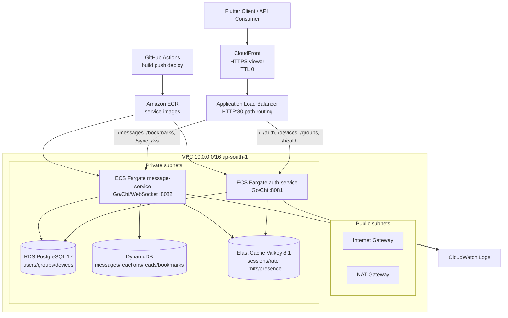
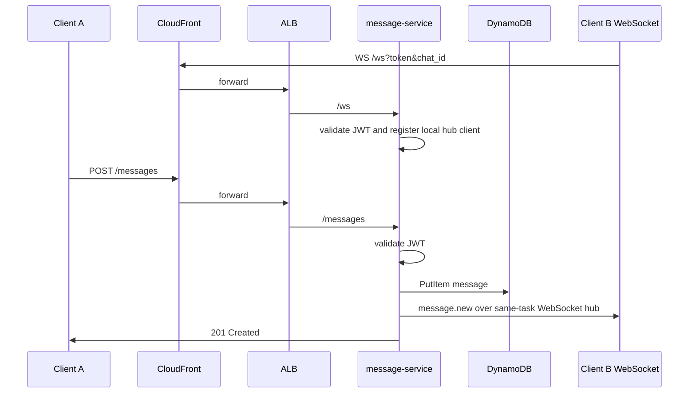
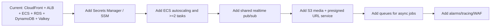

# CloseTalk Infrastructure Architecture Analysis

Generated from repository inspection on 2026-05-09.

Scope: frontend code, Flutter app code, Go backend services, WebSocket code, database adapters, Docker, docker-compose, Terraform, ECS task definitions, GitHub Actions, environment examples, documentation, and local deployment artifacts.

Evidence rule used in this report: concrete code and configuration are treated as authoritative. Product docs are referenced only when they describe planned architecture not yet present in executable config.

Confidence labels:

| Level | Meaning |
| --- | --- |
| High | Directly present in code, Terraform, Docker, GitHub Actions, or task definition files. |
| Medium | Present in docs or partially implemented, but not fully wired in active deployment config. |
| Low | Mentioned as planned only; no active code/config found. |

Important security note: root-level ECS task definition JSON files and Terraform state/variable files are present in the working tree. The inspected task definitions contain live-looking database and JWT secret values. Rotate those secrets and remove generated secret-bearing files from version control.

---

# 1. PROJECT OVERVIEW

| Field | Finding | Evidence | Confidence |
| --- | --- | --- | --- |
| Project name | CloseTalk | `README.md`, `docs/PROJECT.md`, Go module `github.com/OMCHOKSI108/closetalk` in `closetalk_backend/go.mod` | High |
| Purpose | Cross-platform real-time messaging app with auth, groups, multi-device sync, messages, bookmarks, and realtime delivery | `README.md`, `docs/product-vision.md`, backend handlers in `closetalk_backend/cmd/*` | High for current implemented subset, Medium for full product vision |
| Main client | Flutter app scaffold plus feature service classes and screens | `closetalk_app/lib/main.dart`, `closetalk_app/lib/services/*.dart`, `closetalk_app/lib/screens/**` | High |
| Admin/frontend | Next.js starter app, not yet an implemented admin dashboard | `closetalk_frontend/package.json`, `closetalk_frontend/app/page.tsx` | High |
| Backend runtime | Go 1.26 | `closetalk_backend/go.mod`, `closetalk_backend/Dockerfile` | High |
| Backend services | `auth-service` and `message-service` | `closetalk_backend/cmd/auth-service/main.go`, `closetalk_backend/cmd/message-service/main.go` | High |
| Architecture style | Small service-oriented backend / early microservices, not a monolith | Separate ECS services, separate binaries, ALB path routing in `terraform/main.tf` | High |
| Deployment style | AWS ECS Fargate behind ALB and CloudFront; local Docker Compose for dev | `terraform/main.tf`, `closetalk_backend/docker-compose.yml`, `.github/workflows/deploy.yml` | High |
| Primary pattern | Edge CDN -> ALB -> path-routed stateless services -> managed data services | `terraform/main.tf` | High |

Implemented architecture summary:

```text
Flutter client / API client
-> CloudFront HTTPS
-> ALB HTTP listener
-> ECS Fargate auth-service or message-service
-> RDS PostgreSQL, DynamoDB, ElastiCache Valkey
-> CloudWatch Logs
```

Planned architecture in docs includes WebTransport, ScyllaDB, SQS/SNS/EventBridge, Bedrock, S3, OpenSearch, and Global Accelerator. Those are not fully provisioned in the current executable infrastructure.

---

# 2. FRONTEND ARCHITECTURE

There are two frontend surfaces:

1. `closetalk_app`: Flutter mobile/web/desktop app.
2. `closetalk_frontend`: Next.js app, currently the create-next-app starter page.

## Flutter App

| Component | Technology | Purpose | Evidence | Confidence |
| --- | --- | --- | --- | --- |
| Framework | Flutter / Dart SDK `^3.11.3` | Cross-platform app | `closetalk_app/pubspec.yaml` | High |
| UI entrypoint | `MaterialApp` default counter scaffold | Current app shell | `closetalk_app/lib/main.dart` | High |
| State management | None found | No Provider/Riverpod/BLoC package in `pubspec.yaml` | `closetalk_app/pubspec.yaml` | High |
| API communication | Dart `HttpClient` and `package:http` imports | REST calls to backend | `auth_service.dart`, `group_service.dart`, `message_service.dart`, `sync_service.dart` | High for code intent |
| Auth handling | Caller-provided `getToken()` adds `Authorization: Bearer ...` | Client-side token injection | Flutter services | High |
| WebSocket usage | `web_socket_channel` in `webtransport_service.dart` | Realtime chat events, typing, reconnect | `closetalk_app/lib/services/webtransport_service.dart` | High |
| WebTransport usage | File is named `webtransport_service.dart`, but implementation uses WebSocket | `WebSocketChannel.connect(...)` | High |
| Build tools | Flutter tooling | Mobile/web/desktop builds | `pubspec.yaml`, platform folders | High |
| CDN usage | Client expected to call deployed base URL, but no hardcoded CDN config found in Flutter code | Docs mention CloudFront URL | Medium |

Important build caveat: Flutter code imports `package:http/http.dart` and `package:web_socket_channel/web_socket_channel.dart`, but `pubspec.yaml` only lists `flutter` and `cupertino_icons`. The current Flutter app likely will not compile until `http` and `web_socket_channel` are added.

## Next.js Frontend

| Component | Technology | Purpose | Evidence | Confidence |
| --- | --- | --- | --- | --- |
| Framework | Next.js `16.2.6`, React `19.2.4` | Future admin/dashboard frontend | `closetalk_frontend/package.json` | High |
| Styling | Tailwind CSS 4 via `@import "tailwindcss"` | Starter styling | `app/globals.css`, `postcss.config.mjs` | High |
| SSR/CSR/ISR | App Router default server component page | Starter page only | `app/page.tsx`, `app/layout.tsx` | High |
| Static/media | Next Image component and public SVGs | Starter assets | `app/page.tsx`, `public/*.svg` | High |
| Auth handling | None implemented | No auth code found | `closetalk_frontend/app/**` | High |
| API communication | None implemented | Starter page has no backend calls | `app/page.tsx` | High |
| Deployment | No frontend-specific Dockerfile or CI/CD found | Only backend deployment workflow exists | `.github/workflows/deploy.yml` | High |

---

# 3. BACKEND ARCHITECTURE

| Service | Runtime | Framework/Libraries | Port | Primary Responsibility | Evidence | Confidence |
| --- | --- | --- | --- | --- | --- | --- |
| `auth-service` | Go 1.26 | `go-chi/chi`, `pgx`, `go-redis`, JWT, bcrypt, AWS SES v2 SDK | 8081 | Auth, sessions, recovery, devices, groups | `cmd/auth-service/main.go`, `cmd/auth-service/groups.go` | High |
| `message-service` | Go 1.26 | `go-chi/chi`, `gorilla/websocket`, AWS DynamoDB SDK, `pgx`, Valkey | 8082 | Message CRUD, bookmarks, read receipts, WebSocket hub, sync | `cmd/message-service/main.go`, `hub.go` | High |

## Backend Components

| Concern | Implemented Mechanism | Evidence | Confidence |
| --- | --- | --- | --- |
| HTTP routing | Chi router | `cmd/*/main.go` | High |
| REST APIs | Auth, device, group, message, bookmark, sync endpoints | `cmd/*/main.go`, `groups.go` | High |
| Authentication | HS256 JWT access tokens, 15 minute expiry | `internal/auth/jwt.go` | High |
| Refresh sessions | Random UUID refresh tokens stored in Valkey with TTL | `internal/auth/jwt.go`, `internal/database/valkey.go` | High |
| Password hashing | bcrypt cost 12 | `internal/auth/password.go` | High |
| OAuth | Google ID token verification is implemented manually; Apple/GitHub return not implemented | `cmd/auth-service/main.go` | High |
| Authorization | JWT middleware plus ad hoc group admin checks | `internal/middleware/auth.go`, `groups.go` | High |
| Rate limiting | Middleware exists using Valkey counters, but not applied to routes in current `main.go` files | `internal/middleware/ratelimit.go`, `cmd/*/main.go` | Medium |
| Logging | Custom request logging middleware | `internal/middleware/logging.go` | High |
| Background workers | None found | No worker commands, queues, cron, or async processors | High |
| Internal service communication | None found between services | Services share DB/cache but do not call each other | High |
| Realtime | In-process WebSocket hub in message service | `cmd/message-service/hub.go` | High |

## Backend Flow

### Auth Request Lifecycle

```text
Client
-> CloudFront HTTPS
-> ALB path rule `/auth/*`, `/devices/*`, `/groups/*`
-> ECS Fargate auth-service:8081
-> Chi middleware: request id, real IP, logging, recoverer, timeout, CORS
-> Optional JWT middleware for protected routes
-> Handler
-> PostgreSQL for users/devices/groups
-> Valkey for sessions/recovery-rate-limit/session sets
-> JSON response
-> CloudWatch log stream
```

### Message Request Lifecycle

```text
Client
-> CloudFront HTTPS
-> ALB path rule `/messages*`, `/bookmarks*`, `/sync/*`, `/ws`
-> ECS Fargate message-service:8082
-> Chi middleware
-> JWT middleware for REST routes
-> DynamoDB-backed MessageStore if DynamoDB is reachable
-> In-memory MessageStore fallback if DynamoDB init fails
-> Optional PostgreSQL lookup for sync conversation membership
-> In-process WebSocket broadcast for connected clients
-> JSON response
```

### Active REST Endpoints

| Service | Endpoints | Evidence |
| --- | --- | --- |
| Auth | `/`, `/health`, `/auth/register`, `/auth/login`, `/auth/oauth`, `/auth/refresh`, `/auth/recover`, `/auth/recover/email`, `/auth/password`, `/auth/logout` | `cmd/auth-service/main.go` |
| Devices | `/devices`, `/devices/link`, `/devices/revoke` | `cmd/auth-service/main.go` |
| Groups | `/groups`, `/groups/{id}`, `/groups/{id}/invite`, `/groups/join`, member/role/leave/settings/pin routes | `cmd/auth-service/groups.go` |
| Messages | `/messages`, `/messages/{chatId}`, `/messages/{messageId}`, `/messages/{messageId}/react`, `/messages/{messageId}/read` | `cmd/message-service/main.go` |
| Bookmarks | `/bookmarks`, `/bookmarks/{messageId}` | `cmd/message-service/main.go` |
| Sync | `/sync/messages`, `/sync/status`, `/devices/force-revoke` | `cmd/message-service/main.go` |
| Realtime | `/ws?token=&chat_id=` | `cmd/message-service/main.go` |

---

# 4. DATABASE ARCHITECTURE

## Implemented Databases

| Database | Type | Purpose | Access Pattern | Consistency | Evidence | Confidence |
| --- | --- | --- | --- | --- | --- | --- |
| Amazon RDS PostgreSQL 17 | Relational | Users, recovery codes, user devices, conversations, groups, group members, settings, pinned messages | `pgxpool`, SQL queries, connection pool max 25 | Strong consistency per PostgreSQL transaction | `terraform/main.tf`, `internal/database/neon.go`, migrations | High |
| Amazon DynamoDB | NoSQL key-value/document | Messages, reactions, reads, bookmarks in active production deployment | AWS SDK v2, `PutItem`, `Query`, `UpdateItem`, `DeleteItem`; `PAY_PER_REQUEST` | Eventual by default, strongly consistent reads not requested in code | `terraform/main.tf`, `internal/database/dynamodb_store.go` | High |
| ElastiCache Valkey 8.1 | In-memory data store | Refresh sessions, user session sets, rate limit counters, recovery attempt counters, presence check support | Redis protocol via `go-redis/v9` | In-memory single node in current Terraform | `terraform/main.tf`, `internal/database/valkey.go` | High |
| Local PostgreSQL | Containerized dev DB | Local auth/group metadata | Docker Compose service `neon` using `postgres:17-alpine` | Strong local PostgreSQL consistency | `closetalk_backend/docker-compose.yml` | High |
| DynamoDB Local | Containerized dev NoSQL | Local message store | In-memory DynamoDB Local | Local only | `docker-compose.yml` | High |
| ScyllaDB | CQL adapter exists, but not active in Terraform or docker-compose | Planned/alternate message store | `gocql` code exists; not selected by message-service startup | LocalQuorum in code | `internal/database/scylla.go`, `scylla_store.go` | Medium |

## PostgreSQL Details

| Aspect | Finding | Evidence | Confidence |
| --- | --- | --- | --- |
| Engine | PostgreSQL 17.4 in AWS RDS | `aws_db_instance.engine_version = "17.4"` | High |
| Instance | `db.t4g.micro` | `terraform/main.tf` | High |
| Storage | 20 GB gp3, encrypted, max 100 GB | `terraform/main.tf` | High |
| Network | Private subnets only, RDS SG allows 5432 from ECS SG | `terraform/main.tf` | High |
| Backups | 1 day retention | `terraform/main.tf` | High |
| Pooling | `MaxConns = 25`, `MinConns = 2` per service process | `internal/database/neon.go` | High |
| Migrations | In-code auto-migration plus SQL files under `infrastructure/migrations` | `RunMigrations()`, migration files | High |
| ORM | None | Raw SQL with `pgxpool` | High |
| Indexes | Users email/phone hash, conversations last message, participants user, groups invite code, group members user, pinned active index | `neon.go`, SQL migrations | High |
| Replicas | None configured | No RDS replica resources in Terraform | High |
| RLS | Planned in docs, not implemented in migrations | `docs/DATABASE.md` versus migration files | Medium |

## DynamoDB Details

| Table | PK | SK | Indexes | Purpose | Evidence |
| --- | --- | --- | --- | --- | --- |
| `closetalk-messages` | `chat_id` | `sort_key` | GSI `message_id-index` | Chat message history and lookup by ID | `terraform/main.tf`, `dynamodb_store.go` |
| `closetalk-message-reactions` | `message_id` | `user_emoji` | None | Reaction toggles per user/emoji | `terraform/main.tf`, `dynamodb_store.go` |
| `closetalk-message-reads` | `message_id` | `user_id` | None | Read receipts | `terraform/main.tf`, `dynamodb_store.go` |
| `closetalk-bookmarks` | `user_id` | `sort_key` | None | User bookmarks | `terraform/main.tf`, `dynamodb_store.go` |

DynamoDB uses `PAY_PER_REQUEST`, server-side encryption, and point-in-time recovery in Terraform.

## Query Patterns

| Query | Backend Method | Pattern | Risk |
| --- | --- | --- | --- |
| Fetch messages by chat | `GetMessages(chatID, cursor, limit)` | DynamoDB query on `chat_id` and `sort_key < cursor` descending | Good partition pattern for ordinary chat history |
| Fetch message by ID | `GetMessage(messageID)` | GSI query on `message_id-index` | Good |
| Remove bookmark | `RemoveBookmark(userID, messageID)` | Query all bookmarks for user, then scan client-side for message ID | Can degrade for many bookmarks |
| Sync messages across conversations | `handleSyncMessages` | PostgreSQL query for conversation IDs, then per-conversation store queries, in-memory sort | N+1 pattern, expensive as conversation count grows |
| Scylla GetMessage | `ALLOW FILTERING` on `message_id` | Implemented but not active | Poor if Scylla path is used at scale |

---

# 5. CACHE ARCHITECTURE

| Cache | Purpose | Key Pattern | TTL | Evidence | Confidence |
| --- | --- | --- | --- | --- | --- |
| Valkey | Refresh token sessions | `session:{refreshToken}` -> `userID:deviceID` | 7 days for auth refresh tokens | `StoreSession()` in `valkey.go`, auth handlers | High |
| Valkey | User device/session set | `user_sessions:{userID}` set of device IDs | Function accepts TTL but does not apply expiry to set | `StoreUserSession()` in `valkey.go` | High |
| Valkey | Rate limiting | `ratelimit:user:{id}`, `ratelimit:ip:{ip}` | Configured per middleware call, usually 1 minute | `ratelimit.go`, `CheckRateLimit()` | Medium because middleware is not attached to routes |
| Valkey | Recovery attempt limiting | `recover:attempts:{hashOrUser}` | 1 hour | `CheckRecoveryRateLimit()` | High |
| Valkey | Presence checks | `SCard("user_sessions:"+participantID)` | No automatic expiry visible | `handleSyncStatus()` | Medium |

Not found:

| Feature | Status |
| --- | --- |
| Distributed locking | Not found |
| Pub/Sub usage | Planned in docs, not implemented in code |
| Cache warming | Not found |
| Explicit eviction policy | Not configured in Terraform |
| Valkey replicas | Not configured; Terraform uses `num_cache_clusters = 1` |

---

# 6. MESSAGE QUEUE / EVENT SYSTEM

| System | Status | Evidence | Confidence |
| --- | --- | --- | --- |
| Kafka / MSK | Not implemented | No Kafka/MSK configs or dependencies found | High |
| RabbitMQ | Not implemented | No RabbitMQ configs/deps found | High |
| AWS SQS | Planned only in docs | `docs/architecture-flow.md`, `docs/planning.md`; no Terraform resources | Medium |
| AWS SNS | Planned only in docs | Docs mention push/fanout; no Terraform resources | Medium |
| EventBridge Pipes | Planned only in docs | Docs mention; no Terraform resources | Medium |
| BullMQ / Celery | Not implemented | No Node worker/Redis queue or Python worker found | High |
| Background jobs | Not implemented | No worker binaries, scheduled jobs, Lambda, or queue consumers | High |
| DLQ / retry systems | Planned only | Docs mention DLQs; no resources | Medium |

## Producer-Consumer Architecture

Current production code is request-driven and synchronous. Message send writes directly to DynamoDB through the message service, then broadcasts to connected WebSocket clients in the same process. There is no durable event bus or cross-task pub/sub layer.

```text
POST /messages
-> message-service handler
-> DynamoDB PutItem
-> in-process WebSocket hub broadcast
-> HTTP 201 response
```

Scaling implication: if more than one `message-service` task is running, WebSocket clients connected to a different task will not receive in-process broadcasts unless an external pub/sub layer is added.

---

# 7. REALTIME SYSTEMS

| Feature | Current Implementation | Evidence | Confidence |
| --- | --- | --- | --- |
| WebSockets | Gorilla WebSocket server at `/ws?token=&chat_id=` | `cmd/message-service/main.go` | High |
| Client WebSocket | `web_socket_channel` based client service | `closetalk_app/lib/services/webtransport_service.dart` | High |
| WebTransport | Planned/named, not implemented | Docs and filename mention it; code uses WebSocket | High |
| SSE | Planned only | Docs mention SSE; no code/config found | Medium |
| WebRTC calls | Planned only | Docs mention; no code/config found | Medium |
| Typing indicators | WebSocket event types `typing.start`, `typing.stop` broadcast to chat | `readPump()` in message service and Flutter service | High |
| Presence | Partial, inferred from Valkey `user_sessions` set | `handleSyncStatus()` | Medium |
| Push notifications | Not implemented | No APNs/FCM SDK/config; SNS planned only | High |
| Device revocation realtime | In-process disconnect and `device.revoked` message | `hub.disconnectDevice()` | High |

## Realtime Scaling Strategy

Current strategy is single-process/in-memory:

```text
message-service task
-> wsHub.byChat: chatID -> connected clients
-> wsHub.byUser: userID -> deviceID -> client
-> goroutine pumps messages to clients
```

No shared WebSocket session registry or pub/sub is present. ECS desired count is `1` in Terraform, which avoids cross-task fanout issues at the cost of high availability and scalability.

Recommended scaling design:

```text
ALB sticky or non-sticky WebSocket connections
-> N message-service tasks
-> Valkey Pub/Sub or Redis Streams channel per chat/user
-> all tasks subscribe and fan out to local clients
-> DynamoDB remains source of truth
```

---

# 8. STORAGE ARCHITECTURE

| Storage | Current Status | Evidence | Confidence |
| --- | --- | --- | --- |
| S3 media uploads | Not provisioned | No `aws_s3_bucket`, no media service code | High |
| CloudFront | Provisioned as API CDN/proxy to ALB, not media CDN | `terraform/main.tf` | High |
| Local file storage | No app-level uploads found | No upload handlers | High |
| CDN caching | CloudFront exists, but default TTL/min/max TTL are all 0 | `terraform/main.tf` | High |
| Media optimization | Planned only | Docs mention thumbnails/transcoding; no Lambda/S3 config | Medium |
| Container registry | Amazon ECR for two backend images | `terraform/main.tf`, GitHub Actions | High |

The current storage architecture is database-centric: PostgreSQL for metadata and DynamoDB for message-like data. Media upload/storage is a planned feature, not implemented in active infrastructure.

---

# 9. DEVOPS & DEPLOYMENT

## Docker Usage

| File | Purpose | Evidence |
| --- | --- | --- |
| `closetalk_backend/Dockerfile` | Multi-stage Go build from `golang:1.26-alpine` to `alpine:3.21`; non-root user; healthcheck | High |
| `closetalk_backend/Dockerfile.deploy` | Runtime image expecting prebuilt `service.bin`; appears unused by GitHub Actions | Medium |
| `closetalk_backend/docker-compose.yml` | Local dev stack: auth-service, message-service, PostgreSQL, DynamoDB Local, Valkey | High |

## AWS Deployment

| Component | Implementation | Evidence | Confidence |
| --- | --- | --- | --- |
| Compute | ECS Fargate cluster and services | `terraform/main.tf` | High |
| Service count | `auth-service` desired count 1, `message-service` desired count 1 | `terraform/main.tf` | High |
| Container registry | ECR repos for both services with scan on push | `terraform/main.tf` | High |
| Load balancer | Internet-facing ALB, HTTP listener on port 80 | `terraform/main.tf` | High |
| Edge | CloudFront distribution with default cert and HTTPS redirect | `terraform/main.tf` | High |
| Deployment strategy | ECS rolling update through GitHub Actions | `.github/workflows/deploy.yml` | High |
| Blue/green | Not implemented | No CodeDeploy or blue/green config found | High |
| Canary | Not implemented | No weighted target groups or canary workflow | High |
| Kubernetes | Not implemented | No project K8s manifests/Helm charts found | High |

## CI/CD Flow

Actual GitHub Actions flow:

```text
Push to master with changes under closetalk_backend/**
or manual workflow_dispatch
-> checkout
-> configure AWS credentials from GitHub secrets
-> login to Amazon ECR
-> build auth-service and message-service images in matrix
-> tag image with GitHub SHA
-> push to ECR
-> download current ECS task definition
-> render task definition with new image
-> deploy to ECS service
-> wait for service stability
```

Evidence: `.github/workflows/deploy.yml`.

Important mismatch: repository docs mention push to `main`, but workflow triggers `master`.

---

# 10. KUBERNETES ARCHITECTURE

Kubernetes is not present in the actual repository.

| K8s Artifact | Status | Evidence |
| --- | --- | --- |
| Namespaces | Not found | No project `*.yaml` with Kubernetes resources |
| Ingress | Not found | No Kubernetes manifests |
| Services | Not found | No Kubernetes manifests |
| Deployments | Not found | No Kubernetes manifests |
| StatefulSets | Not found | No Kubernetes manifests |
| HPA | Not found | No autoscaling manifests |
| PVC/PV | Not found | No storage manifests |
| Secrets/ConfigMaps | Not found | No Kubernetes manifests |
| Helm chart | Not found | No `Chart.yaml` or Helm values in project files |

## Kubernetes Component Flow

Not applicable to current implementation.

If migrated later, the closest mapping would be:

```text
Ingress Controller
-> auth-service Deployment + Service
-> message-service Deployment + Service
-> External RDS PostgreSQL
-> External DynamoDB
-> External ElastiCache Valkey
-> CloudWatch/OpenTelemetry collector
```

---

# 11. CLOUD ARCHITECTURE

## AWS Resources in Terraform

| Layer | AWS Service | Purpose | Evidence | Confidence |
| --- | --- | --- | --- | --- |
| Network | VPC | `10.0.0.0/16` app network | `terraform/main.tf` | High |
| Network | Public subnets | ALB and NAT placement across `ap-south-1a/b` | `terraform/main.tf` | High |
| Network | Private subnets | ECS, RDS, ElastiCache placement | `terraform/main.tf` | High |
| Network | Internet Gateway | Public internet ingress/egress | `terraform/main.tf` | High |
| Network | NAT Gateway | Private subnet outbound access | `terraform/main.tf` | High |
| Edge | CloudFront | HTTPS endpoint and proxy/cache layer | `terraform/main.tf` | High |
| Load balancing | ALB | Path-based routing to ECS services | `terraform/main.tf` | High |
| Compute | ECS Fargate | Runs auth and message containers | `terraform/main.tf` | High |
| Registry | ECR | Stores service images | `terraform/main.tf` | High |
| Relational DB | RDS PostgreSQL | Metadata | `terraform/main.tf` | High |
| NoSQL | DynamoDB | Messages, reactions, reads, bookmarks | `terraform/main.tf` | High |
| Cache | ElastiCache Valkey | Sessions/rate-limit/presence | `terraform/main.tf` | High |
| Observability | CloudWatch Logs | Container log groups | `terraform/main.tf` | High |
| Email | SES v2 SDK | Recovery email send path | `go.mod`, `cmd/auth-service/main.go` | Medium because IAM policy is not present in Terraform |

## Networking

| Item | Value | Evidence |
| --- | --- | --- |
| Region | `ap-south-1` default | `terraform/variables.tf` |
| AZs | `ap-south-1a`, `ap-south-1b` | `terraform/main.tf` |
| VPC CIDR | `10.0.0.0/16` | `terraform/main.tf` |
| Public subnets | `10.0.0.0/24`, `10.0.1.0/24` | `terraform/main.tf` |
| Private subnets | `10.0.10.0/24`, `10.0.11.0/24` | `terraform/main.tf` |
| ALB SG | Inbound 80 and 443 from `0.0.0.0/0` | `terraform/main.tf` |
| ECS SG | Inbound 8081-8082 from ALB SG | `terraform/main.tf` |
| RDS SG | Inbound 5432 from ECS SG | `terraform/main.tf` |
| ElastiCache SG | Inbound 6379 from ECS SG | `terraform/main.tf` |

## API Gateway

No AWS API Gateway resource exists. The ALB acts as the HTTP routing gateway.

## IAM

| Role/Policy | Purpose | Evidence |
| --- | --- | --- |
| ECS execution role | ECR image pull and CloudWatch Logs | `terraform/main.tf` |
| ECS task role | DynamoDB CRUD on four tables | `terraform/main.tf` |
| GitHub Actions AWS IAM user | Used through secrets by `configure-aws-credentials` | `.github/workflows/deploy.yml` |

Not found: IAM least-privilege for SES, Secrets Manager access, S3, SQS/SNS, or WAF.

---

# 12. SECURITY ARCHITECTURE

## Implemented Security Controls

| Control | Implementation | Evidence | Confidence |
| --- | --- | --- | --- |
| Transport encryption client edge | CloudFront redirects viewers to HTTPS using default certificate | `terraform/main.tf` | High |
| Origin transport | CloudFront connects to ALB over HTTP only | `origin_protocol_policy = "http-only"` in `terraform/main.tf` | High |
| Auth tokens | HS256 JWT access tokens, 15 minutes | `internal/auth/jwt.go` | High |
| Password hashing | bcrypt cost 12 | `internal/auth/password.go` | High |
| Refresh token storage | Valkey keys with TTL | `internal/database/valkey.go` | High |
| Recovery codes | Random codes, SHA-256 hashed in DB | `internal/auth/password.go`, `handleRegister` | High |
| DB network isolation | RDS and ElastiCache reachable from ECS SG only | `terraform/main.tf` | High |
| DynamoDB encryption | SSE enabled | `terraform/main.tf` | High |
| DynamoDB PITR | Enabled | `terraform/main.tf` | High |
| RDS encryption | Storage encrypted | `terraform/main.tf` | High |
| Non-root containers | `adduser` then `USER closetalk` | `closetalk_backend/Dockerfile` | High |
| ECR scanning | `scan_on_push = true` | `terraform/main.tf` | High |

## Security Gaps / Risks

| Risk | Detail | Evidence | Severity |
| --- | --- | --- | --- |
| Secrets in repository/worktree | ECS task JSON files and Terraform state/vars are present; task definitions contain sensitive env values | `auth-task-def*.json`, `msg-task-def*.json`, `terraform.tfstate`, `terraform.tfvars` present in workspace | Critical |
| Terraform passes secrets as plaintext env vars | `JWT_SECRET`, `DATABASE_URL` with password are container environment variables | `terraform/main.tf` | High |
| No Secrets Manager integration | No `aws_secretsmanager_secret` or ECS `secrets` block found | `terraform/main.tf` | High |
| CloudFront to ALB is HTTP | Viewer HTTPS terminates at CloudFront; origin leg is unencrypted | `origin_protocol_policy = "http-only"` | Medium |
| ALB exposes HTTP directly | ALB SG allows port 80 from public internet; no ALB HTTPS listener/cert | `terraform/main.tf` | Medium |
| CORS allows all origins with credentials | `AllowedOrigins: ["*"]`, `AllowCredentials: true` | both service `main.go` files | High |
| WebSocket origin check allows all | `CheckOrigin: func(...) bool { return true }` | `cmd/message-service/main.go` | High |
| JWT audience not checked | Google ID token verification does not validate `aud` against configured client ID | `verifyGoogleIDToken()` | High |
| Rate-limit middleware not applied | Middleware exists but routes do not use `IPRateLimit` or `UserRateLimit` | `main.go` files | Medium |
| RDS backup retention low | 1 day | `terraform/main.tf` | Medium |
| No WAF/DDoS layer beyond AWS defaults | No WAF resource found | Terraform | Medium |
| No RLS in active migrations | Docs plan RLS; code migrations do not enable it | migration files | Medium |

## Auth / OAuth

| Method | Status |
| --- | --- |
| Email/password | Implemented |
| Google OAuth | ID token verification path implemented |
| Apple OAuth | Returns not implemented |
| GitHub OAuth | Returns not implemented |
| MFA | Listed in docs/API but not implemented |
| RBAC/admin | JWT has `is_admin`; middleware exists; no admin dashboard routes implemented |

---

# 13. MONITORING & OBSERVABILITY

| Tool | Status | Evidence | Confidence |
| --- | --- | --- | --- |
| CloudWatch Logs | Implemented for ECS containers with 30 day retention | `aws_cloudwatch_log_group` resources and task log config | High |
| ECS Container Insights | Enabled on cluster | `aws_ecs_cluster` setting | High |
| Structured app logs | Basic request logging middleware; exact output format in code | `internal/middleware/logging.go` | High |
| Prometheus | Not implemented | No config/dependency found | High |
| Grafana | Not implemented | No config found | High |
| Loki | Not implemented | No config found | High |
| ELK/OpenSearch | Planned for search in docs, not implemented in Terraform | docs only | Medium |
| Datadog | Not implemented | No config found | High |
| OpenTelemetry/tracing | Not implemented | No OTel dependencies/config found | High |
| Alerting | Not implemented | No CloudWatch alarms found | High |
| Dashboards | Not implemented | No dashboard resources found | High |

Observability is currently log-centric. There are no metrics alarms, traces, synthetic checks, or SLO dashboards in code/config.

---

# 14. SCALABILITY ANALYSIS

## Readiness

| Area | Current State | Scalability Assessment |
| --- | --- | --- |
| Stateless HTTP services | Services mostly stateless except in-process WebSocket hub | Good for REST horizontal scaling; realtime needs external pub/sub |
| ECS Fargate | Desired count 1 per service | Manually scalable, not highly available |
| ALB/CloudFront | Managed edge/load-balancing | Good baseline |
| PostgreSQL | Single `db.t4g.micro`, no read replicas, per-process pool max 25 | Bottleneck for auth/group/sync metadata |
| DynamoDB | On-demand billing, partitioned by chat/user/message | Good baseline for message writes, but hot chat partitions possible |
| Valkey | Single `cache.t4g.micro`, no replica | SPOF for sessions/rate limiting |
| WebSockets | In-memory hub in one service task | Does not scale safely across multiple tasks without pub/sub |
| CI/CD | Rolling ECS deploy | Basic production path exists |
| CDN caching | TTL 0 | No cache offload currently |

## Single Points of Failure

| SPOF | Impact | Evidence |
| --- | --- | --- |
| `auth-service` single ECS task | Auth/group/device routes unavailable during task failure/deploy | `desired_count = 1` |
| `message-service` single ECS task | Messaging and WebSockets unavailable during task failure/deploy | `desired_count = 1` |
| RDS single instance | Metadata DB outage | No Multi-AZ/read replica config |
| Valkey single cache node | Sessions/presence/rate-limit unavailable | `num_cache_clusters = 1` |
| NAT Gateway single AZ | Private subnet egress failure if NAT/AZ fails | one NAT in public subnet 0 |
| In-process WebSocket hub | Realtime state lost on restart; no cross-task fanout | `hub.go` |

## Bottlenecks

| Bottleneck | Cause | Recommended Fix |
| --- | --- | --- |
| WebSocket fanout | In-memory only | Valkey Pub/Sub, Redis Streams, NATS, or managed event bus |
| PostgreSQL connections | `MaxConns = 25` per service process, small RDS class | PgBouncer/RDS Proxy, larger instance, query optimization |
| Sync endpoint | Per-conversation query loop and in-memory sort | Denormalized per-user inbox table or DynamoDB GSI by recipient/user |
| Bookmark removal | Scans user bookmarks client-side | Add message ID index or deterministic sort key |
| No autoscaling | ECS desired count fixed | ECS target tracking policies |
| No CDN caching | TTL 0 | Cache safe GET endpoints separately |

Estimated current scale: suitable for a small MVP or demo, not production at the target scale from docs. The architecture can grow, but HA, autoscaling, secret management, external realtime fanout, alarms, and backup policy need work first.

---

# 15. SYSTEM DATA FLOW

## Public API Flow

```text
Flutter App / API Client
-> CloudFront default HTTPS endpoint
-> ALB HTTP origin
-> ALB path rule
-> ECS Fargate service
-> PostgreSQL or DynamoDB or Valkey
-> CloudWatch Logs
-> JSON response
```

## Auth Registration Flow

```text
Client POST /auth/register
-> CloudFront
-> ALB -> auth-service
-> bcrypt password hash
-> PostgreSQL users insert
-> PostgreSQL user_settings insert
-> PostgreSQL recovery_codes insert
-> JWT access token generated
-> Valkey session:{refreshToken} set with 7 day TTL
-> Client receives access token, refresh token, recovery codes
```

## Login / Refresh Flow

```text
Client POST /auth/login
-> auth-service
-> PostgreSQL user lookup
-> bcrypt password check
-> JWT access token
-> Valkey refresh session
-> response

Client POST /auth/refresh
-> auth-service
-> Valkey lookup old refresh token
-> Valkey delete old token
-> Valkey store new refresh token
-> response
```

## Message Send Flow

```text
Client POST /messages
-> CloudFront
-> ALB -> message-service
-> JWT middleware
-> Build message model
-> DynamoDB PutItem to closetalk-messages
-> In-process hub.broadcastToChat(chat_id)
-> In-process hub.broadcastToUserDevices(recipient_ids)
-> HTTP 201 response
```

## Message History Flow

```text
Client GET /messages/{chatId}?cursor=&limit=
-> message-service
-> DynamoDB Query chat_id + sort_key
-> DynamoDB Query reactions per message
-> response with next_cursor
```

## WebSocket Flow

```text
Client WS /ws?token={jwt}&chat_id={id}
-> CloudFront/ALB route to message-service
-> JWT token validation from query parameter
-> Gorilla WebSocket upgrade
-> Register client in wsHub.byChat and wsHub.byUser
-> Ping every 30 seconds
-> typing.start/typing.stop events broadcast to chat
-> message.new/message.updated/message.reaction/message.status sent through hub
```

## Multi-Device Sync Flow

```text
Client GET /sync/messages?after=&limit=
-> message-service
-> JWT middleware
-> PostgreSQL query conversation_participants for user
-> For each conversation ID: DynamoDB Query messages
-> In-memory sort and trim
-> response with messages, has_more, next_cursor
```

## Group Management Flow

```text
Client /groups request
-> auth-service
-> JWT middleware
-> PostgreSQL transaction
-> conversations, groups, group_members, conversation_participants
-> response
```

## Local Development Flow

```text
docker-compose up
-> auth-service container
-> message-service container
-> postgres:17-alpine as local metadata DB
-> dynamodb-local in-memory for messages
-> valkey:8.1-alpine for sessions/cache
```

---

# 16. FINAL ARCHITECTURE SUMMARY

## Concise Summary

| Category | Summary |
| --- | --- |
| Architecture style | Early microservices / service-oriented backend with Flutter client and placeholder Next.js admin frontend |
| Runtime | Go 1.26 services on ECS Fargate |
| Edge/API | CloudFront HTTPS proxy to ALB with path-based routing |
| Data | RDS PostgreSQL for metadata, DynamoDB for messages/bookmarks/reactions/reads, Valkey for sessions/cache |
| Realtime | WebSocket hub in message-service; WebTransport is planned but not implemented |
| DevOps | Terraform for AWS infra, Docker for services, GitHub Actions deploy to ECS/ECR |
| Observability | CloudWatch Logs and ECS Container Insights only |
| Kubernetes | Not present |
| Production readiness | MVP/demo level, not yet robust production |
| Estimated scale handling | Low to modest usage with current desired count 1 and small data nodes; DynamoDB can absorb more message writes than the realtime and PostgreSQL layers |

## Recommended Improvements

| Priority | Improvement | Why |
| --- | --- | --- |
| P0 | Rotate leaked secrets and remove task definition/state/vars from Git tracking | Current secret exposure is critical |
| P0 | Move secrets to AWS Secrets Manager or SSM Parameter Store and ECS `secrets` blocks | Avoid plaintext env secrets |
| P0 | Fix CORS and WebSocket origin policy | Current `*` origins with credentials and open WS origin are unsafe |
| P1 | Add ECS service autoscaling and desired count >= 2 | Baseline HA |
| P1 | Add Valkey Pub/Sub or another shared realtime bus | Required for multi-task WebSocket scaling |
| P1 | Enable RDS Multi-AZ or RDS Proxy/PgBouncer | Reduce metadata SPOF and connection pressure |
| P1 | Add CloudWatch alarms and dashboards | Operational readiness |
| P1 | Add S3 media bucket and presigned upload service if media sharing is in scope | Product docs require media, but infra is absent |
| P2 | Add ALB HTTPS origin or restrict public ALB access to CloudFront | Improve transport and edge security |
| P2 | Add WAF in front of CloudFront or ALB | Basic web protection |
| P2 | Fix Flutter dependency declarations | Current client service imports are not declared |
| P2 | Add durable queue/event layer for moderation, notifications, and async processing | Needed for planned architecture |

## Mermaid Diagram Suggestions

### Current Implemented AWS Architecture



### Current Realtime Flow



### Target Architecture Gap Overlay


