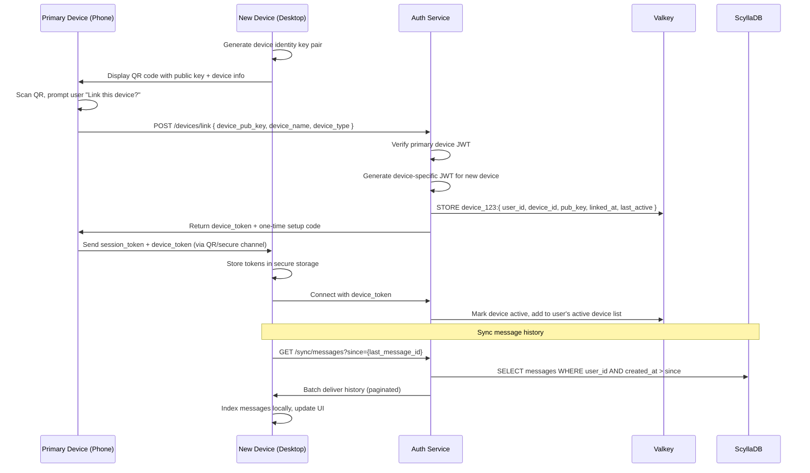
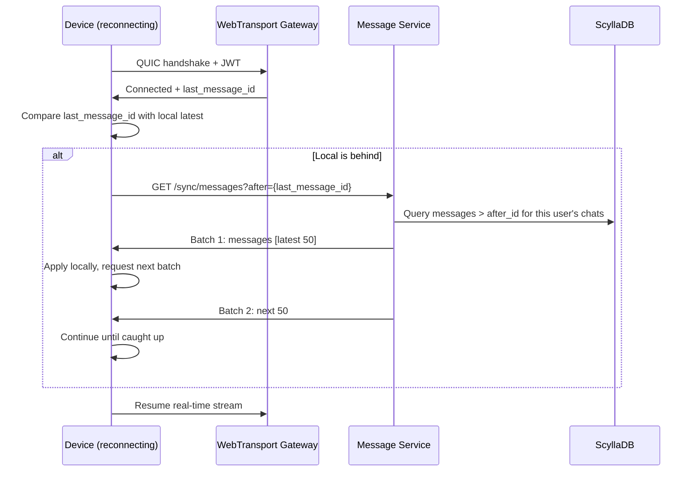
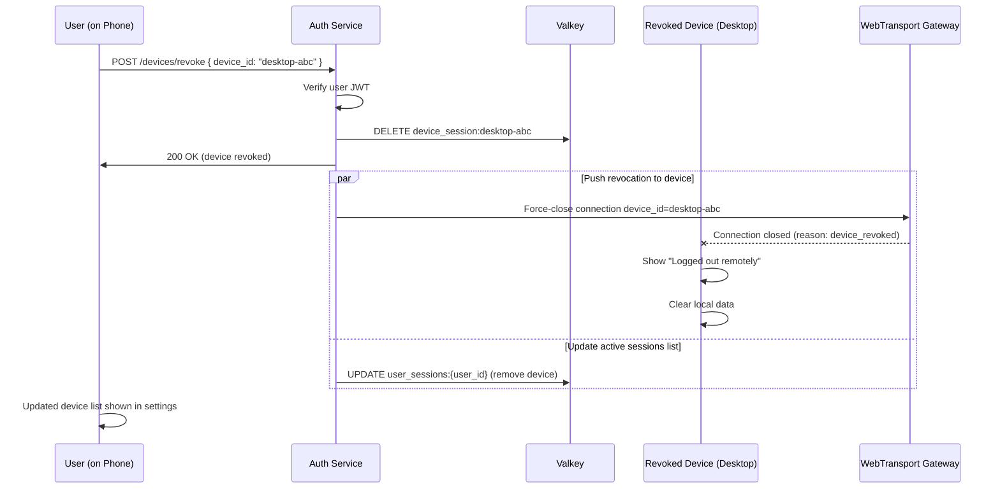

# CloseTalk — Multi-Device Sync Protocol

## Overview

CloseTalk supports **native multi-device** from day 1 — unlike WhatsApp which retrofitted it years later and required the phone to stay online as a relay. In CloseTalk, each device connects independently to the server with its own WebTransport connection, its own identity key, and its own session.

### Key Design Principles

1. **Phone is NOT a relay** — every device is equal and independent
2. **Each device has its own identity key** — E2EE sessions are per-device-pair
3. **Messages sync in real-time** — via server-side fan-out to all linked devices
4. **History sync on link** — new device fetches message history from ScyllaDB
5. **Device revocation is instant** — terminate all connections of revoked device

```
┌────────────────────────────────────────────────────┐
│                    User Alice                        │
│                                                     │
│  ┌──────────┐  ┌──────────┐  ┌──────────┐          │
│  │  Phone   │  │  Tablet  │  │ Desktop  │          │
│  │ (Main)   │  │ (Linked) │  │ (Linked) │          │
│  └────┬─────┘  └────┬─────┘  └────┬─────┘          │
│       │             │             │                 │
│       │  Independent WebTransport Connections        │
│       │  (Each has own JWT + identity key)           │
└───────┼─────────────┼─────────────┼─────────────────┘
        │             │             │
┌───────▼─────────────▼─────────────▼─────────────────┐
│                   Server                              │
│                                                       │
│  ┌─────────────────────────────────────────────┐     │
│  │         Message Service                       │     │
│  │  Receives message → persists to ScyllaDB     │     │
│  │  → fans out to ALL linked devices             │     │
│  └─────────────────────────────────────────────┘     │
│                                                       │
│  ┌─────────────────────────────────────────────┐     │
│  │         Valkey Session Store                  │     │
│  │  user_123:{                                    │     │
│  │    devices: [                                  │     │
│  │      { id: "phone", last_active: ... },        │     │
│  │      { id: "tablet", last_active: ... },       │     │
│  │      { id: "desktop", last_active: ... }       │     │
│  │    ]                                           │     │
│  │  }                                             │     │
│  └─────────────────────────────────────────────┘     │
└─────────────────────────────────────────────────────┘
```

---

## Device Lifecycle

### 1. Linking a New Device



### 2. Sending a Message (Multi-Device Flow)

```mermaid
sequenceDiagram
    participant S as Sender Device
    participant MS as Message Service
    participant SDB as ScyllaDB
    participant R1 as Recipient Device 1
    participant R2 as Recipient Device 2
    participant R3 as Recipient Device 3 (offline)

    S->>MS: POST /messages { chat_id, content, device_id }
    MS->>MS: Validate, rate-limit, store
    MS->>SDB: INSERT message

    MS->>MS: Look up recipient's linked devices in Valkey

    par Send to Device 1 (online)
        MS->>R1: Push via WebTransport stream
        R1->>MS: ACK (delivered)
    and Send to Device 2 (online)
        MS->>R2: Push via WebTransport stream
        R2->>MS: ACK (delivered)
    and Send to Device 3 (offline)
        MS->>MS: Queue for later delivery
        MS->>SNS: Push notification (APNs/FCM)

    MS->>S: Delivery status update
```

### 3. Receiving Messages on Offline Device (Catch-Up Sync)

When a device comes back online:



### 4. Device Revocation



---

## Data Structures

### Device Record (Valkey)

```json
{
  "device_id": "uuid-v4",
  "user_id": "uuid-v4",
  "device_name": "Alice's MacBook Pro",
  "device_type": "desktop",       // phone | tablet | desktop | web
  "platform": "macos",            // android | ios | windows | macos | linux | web
  "public_key": "base64-encoded-ed25519-pubkey",
  "push_token": "fcm-or-apns-token",
  "linked_at": "2026-05-09T10:00:00Z",
  "last_active": "2026-05-09T14:30:00Z",
  "app_version": "1.0.0",
  "is_active": true
}
```

### Message Sync Response

```json
{
  "sync_id": "uuid",
  "messages": [
    {
      "message_id": "uuid",
      "chat_id": "uuid",
      "sender_id": "uuid",
      "sender_device_id": "uuid",
      "content_type": "text",
      "content": "Hello!",
      "created_at": "2026-05-09T14:00:00Z",
      "status": "sent"
    }
  ],
  "has_more": false,
  "next_cursor": "cursor-token"
}
```

---

## E2EE Key Distribution (Multi-Device)

For E2EE chats, each device pair has its own session key:

```
User A (Phone) ─────────────────── User B (Phone)
       │                                    │
       ├── Session Key A-phone ↔ B-phone    │
       │                                    │
User A (Desktop) ────────────────── User B (Desktop)
       │                                    │
       ├── Session Key A-desktop ↔ B-desktop│
       │                                    │
User A (Tablet) ─────────────────── User B (Tablet)
       │                                    │
       └── Session Key A-tablet ↔ B-tablet  ┘
```

When User A sends a message from their phone, it is:
1. E2EE encrypted with the session key for `A-phone → B-phone`
2. Sent to the server
3. Server decrypts it (if server-side delivery) OR stores encrypted (if true E2EE)
4. Delivered to ALL of B's devices using the per-device-pair key

---

## Device Limits & Policies

| Constraint | Limit |
|---|---|
| Max devices per user | 5 (configurable) |
| Max devices per platform | 2 (e.g., 2 phones, 2 tablets) |
| History sync batch size | 50 messages per page |
| History sync max depth | 30 days (configurable) |
| Device idle timeout | 30 days (auto-revoke if inactive) |
| Link cooldown | 5 min between new device links |
